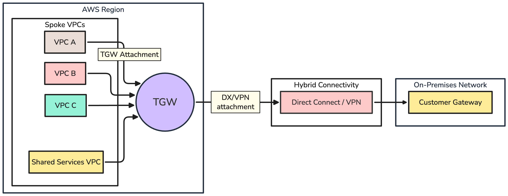
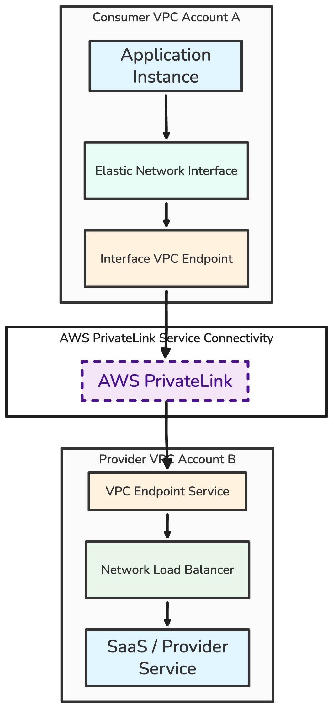
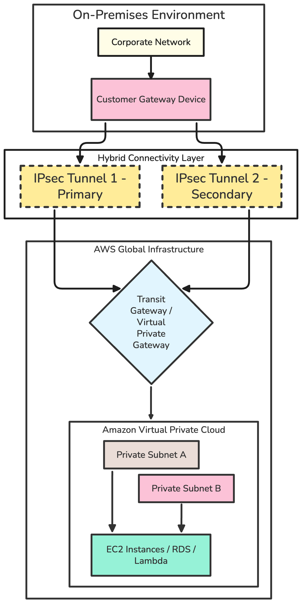
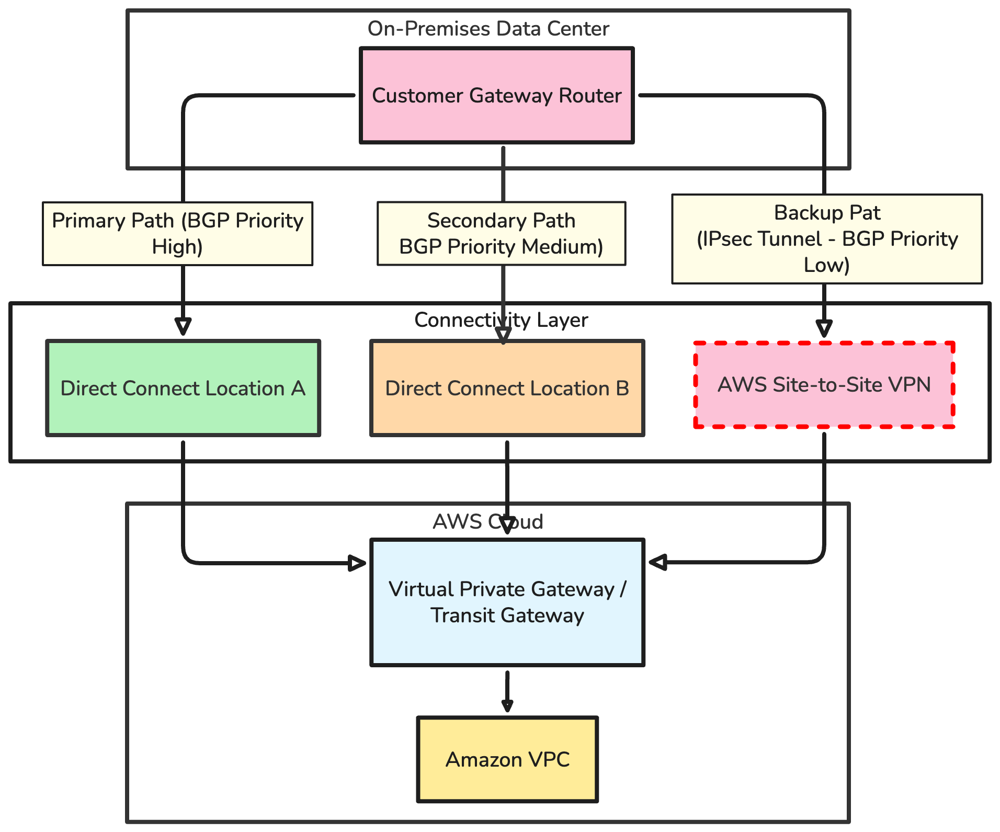
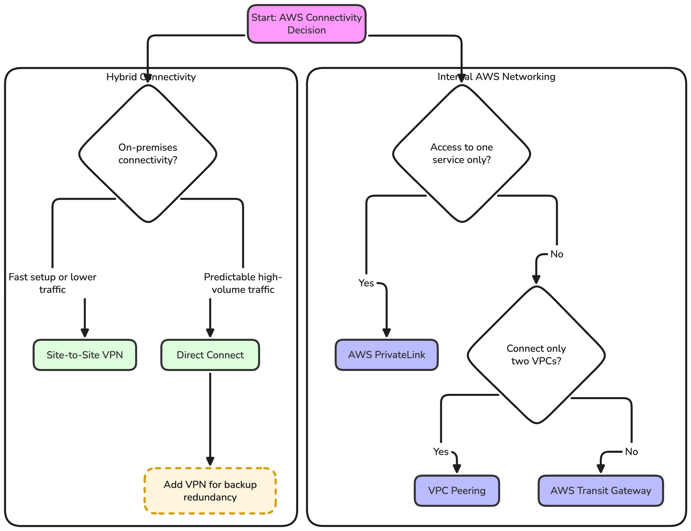

# AWS Connectivity Options — Practical DevOps Reference

This reference is for engineers selecting or troubleshooting AWS connectivity options. It is intentionally practical: enough detail to reason during design reviews and incidents, without turning into a full networking textbook.

## Table of Contents

- [1. Purpose](#1-purpose)
- [2. Connectivity Decision Overview](#2-connectivity-decision-overview)
- [3. VPC Peering](#3-vpc-peering)
- [4. Transit Gateway](#4-transit-gateway)
- [5. AWS PrivateLink](#5-aws-privatelink)
- [6. Site-to-Site VPN](#6-site-to-site-vpn)
- [7. AWS Direct Connect](#7-aws-direct-connect)
- [8. Route Tables](#8-route-tables)
- [9. Security Groups, NACLs, and Firewalls](#9-security-groups-nacls-and-firewalls)
- [10. DNS Considerations](#10-dns-considerations)
- [11. Common Connectivity Problems](#11-common-connectivity-problems)
- [12. Practical Troubleshooting Order](#12-practical-troubleshooting-order)
- [13. Decision Guide](#13-decision-guide)
- [14. Operational Summary](#14-operational-summary)

## 1. Purpose

Selecting an AWS connectivity option depends on the number of networks, required communication scope, transitive routing requirements, CIDR overlap, bandwidth and latency, availability requirements, security boundaries, operational complexity, and cost.

> A connection resource alone is not enough. End-to-end connectivity also requires correct forward and return routes, security rules, DNS resolution, and application listeners.

## 2. Connectivity Decision Overview

| Requirement                                                  | Typical option                           |
| ------------------------------------------------------------ | ---------------------------------------- |
| Connect two VPCs directly                                    | VPC Peering                              |
| Connect many VPCs through a central router                   | Transit Gateway                          |
| Expose one private service without full network connectivity | PrivateLink                              |
| Connect on-premises over the internet                        | Site-to-Site VPN                         |
| Dedicated private on-premises connectivity                   | Direct Connect                           |
| Highly available hybrid connectivity                         | Redundant Direct Connect with VPN backup |

## 3. VPC Peering

VPC Peering provides direct private connectivity between two VPCs. It can work across accounts and regions, and traffic uses private IP addresses. The VPC CIDR ranges must not overlap.

VPC Peering is non-transitive. Each side needs route-table entries for the other VPC, and security groups, NACLs, DNS settings, and application listeners still need to allow the traffic.

```text
VPC A: 10.0.0.0/16
        |
        | VPC Peering
        |
VPC B: 10.20.0.0/16
```

Route examples:

```text
VPC A route table:
10.20.0.0/16 → pcx-123456

VPC B route table:
10.0.0.0/16 → pcx-123456
```

Non-transitive routing:

```text
VPC A ←→ VPC B ←→ VPC C

VPC A cannot reach VPC C through VPC B.
A separate connection or central routing service is required.
```

Use VPC Peering when there are only a small number of direct VPC-to-VPC connections, routing is simple, CIDRs do not overlap, and there is no need for a central routing domain.

Do not use VPC Peering for a large mesh, for transitive routing, for overlapping CIDRs, or when centralized inspection and segmentation are core requirements. It becomes difficult to manage as the number of VPCs grows.

## 4. Transit Gateway

Transit Gateway is a regional network transit hub. It connects multiple VPCs, VPNs, and Direct Connect connectivity through attachments. It supports transitive routing and is commonly used for hub-and-spoke architectures.

Transit Gateway has its own route tables. This allows route-domain separation, such as production, non-production, shared services, and hybrid connectivity. It is simpler than managing a large peering mesh, but it adds cost and routing complexity.

<p align="center">
  
</p>

There are two routing layers to verify:

```text
VPC subnet route table
        ↓
Transit Gateway attachment
        ↓
Transit Gateway route table
        ↓
Destination attachment
        ↓
Destination VPC route table
```

Attachment association and route propagation are different concepts. Association decides which TGW route table an attachment uses for forwarding. Propagation controls whether routes from an attachment are inserted into a TGW route table.

Segmentation example:

```text
Production TGW route table:
- production VPCs
- shared services
- on-premises

Non-production TGW route table:
- development VPCs
- testing VPCs
- shared services

No direct route between production and development unless explicitly required.
```

## 5. AWS PrivateLink

AWS PrivateLink provides private access to a specific service. It does not provide full network-to-network connectivity.

PrivateLink commonly uses an endpoint service backed by a Network Load Balancer. Consumers create interface VPC endpoints in their VPCs. Traffic stays on private AWS networking, and consumers do not need routes to the provider VPC CIDR.

<p align="center">
  
</p>

PrivateLink is useful for SaaS, cross-account services, and strict security boundaries. It avoids exposing an entire VPC network when only one service should be reachable.

```text
VPC Peering / Transit Gateway:
network-to-network connectivity

PrivateLink:
consumer-to-specific-service connectivity
```

Limitations include service directionality, endpoint and data-processing cost, per-AZ endpoint placement, DNS behavior, and load balancer requirements. It is a service exposure pattern, not a general routing fabric.

## 6. Site-to-Site VPN

Site-to-Site VPN uses encrypted IPsec tunnels over the public internet to connect an on-premises network to AWS. It terminates on a Virtual Private Gateway or Transit Gateway and normally provides two tunnels for redundancy.

VPN can use static routes or BGP. It is useful for initial hybrid connectivity, smaller environments, and backup connectivity. Latency and bandwidth depend on internet conditions.

<p align="center">
  
</p>

Both tunnels should be configured and monitored. Configuring only one tunnel removes the intended AWS tunnel redundancy.

Check matching encryption parameters, BGP ASN configuration, route propagation, firewall rules, overlapping CIDRs, tunnel health, and tunnel monitoring. A VPN tunnel being up only proves that the tunnel exists; it does not prove that application traffic can pass.

## 7. AWS Direct Connect

AWS Direct Connect provides dedicated private connectivity from a data center or colocation facility to AWS. It is commonly used for larger or sustained hybrid traffic because throughput and latency are more predictable than internet-based VPN.

Direct Connect uses virtual interfaces and can connect through a Direct Connect Gateway to a Transit Gateway or Virtual Private Gateway. It is not automatically highly available. Resilient designs use redundant physical connections and locations, and VPN is commonly retained as backup.

<p align="center">
  
</p>

Resilient design:

The diagram shows the primary Direct Connect path. Resilient designs should use redundant Direct Connect paths and usually keep Site-to-Site VPN as a backup path.

Direct Connect does not mean traffic is automatically encrypted end to end. Use MACsec where supported or application-level encryption where required by policy, compliance, or data sensitivity.

## 8. Route Tables

AWS route tables use longest-prefix matching. The most specific matching route wins.

```text
Destination        Target
10.0.0.0/16        local
10.20.0.0/16       tgw-123456
10.20.1.0/24       firewall-endpoint
0.0.0.0/0          nat-123456
```

```text
Traffic to 10.20.1.10 uses the /24 route because it is more specific
than the 10.20.0.0/16 route.
```

> Always verify the complete forward and return path. A valid route in only one direction does not provide working connectivity.

Full path to inspect:

```text
Source application
    ↓
Source security group
    ↓
Source subnet route table
    ↓
Peering / TGW / VPN / Direct Connect
    ↓
Destination route table
    ↓
Destination NACL
    ↓
Destination security group
    ↓
Application listener
    ↓
Return path
```

## 9. Security Groups, NACLs, and Firewalls

### Security groups

Security groups are stateful and are attached to ENIs or supported resources. Return traffic is automatically allowed. Permit only required protocols, ports, and sources.

### Network ACLs

Network ACLs are stateless and are attached to subnets. They require explicit forward and return rules. Ephemeral ports may need to be allowed, especially for return traffic.

### Network Firewall or third-party appliances

Centralized inspection can use AWS Network Firewall or third-party appliances. These designs require deliberate routing and can introduce asymmetric-routing problems. Appliance mode may be required in some Transit Gateway designs.

## 10. DNS Considerations

Working routes do not guarantee working DNS. Verify the name from the source environment, not only from an administrator workstation.

Common DNS components include Route 53 private hosted zones, VPC DNS settings, conditional forwarding, Route 53 Resolver inbound endpoints, Route 53 Resolver outbound endpoints, on-premises DNS integration, private DNS with interface endpoints, and cross-account private hosted-zone associations.

Hybrid inbound example:

```text
On-Premises DNS
      |
      | forwards aws.internal
      v
Route 53 Resolver Inbound Endpoint
      |
Private Hosted Zone
```

Hybrid outbound example:

```text
AWS workload
      |
      | queries corp.internal
      v
Route 53 Resolver Outbound Endpoint
      |
On-Premises DNS
```

## 11. Common Connectivity Problems

| Symptom | Common cause | What to verify |
| ------- | ------------ | -------------- |
| Connection timeout | Missing route, security-group denial, firewall denial, or application unreachable | Forward route, return route, SGs, NACLs, firewall policy, listener |
| Connection refused | Destination reached but service is not listening or is rejecting the connection | Process bind address, port, local firewall, load balancer target health |
| Traffic works in one direction only | Missing return route, stateless NACL rule, or asymmetric routing | Reverse route, ephemeral ports, firewall state tables |
| VPC peering is active but traffic fails | Missing route-table entry, overlapping CIDRs, SG denial, or DNS issue | Both VPC route tables, CIDRs, SG references, private DNS settings |
| Transit Gateway attachment exists but no traffic passes | Wrong TGW route-table association or route not propagated | Attachment association, propagation, TGW route tables, VPC subnet routes |
| VPN tunnel is up but application traffic fails | Route, firewall, BGP, CIDR, or security control mismatch | BGP routes, propagated routes, customer firewall, SGs, NACLs |
| Direct Connect is active but a prefix is unreachable | Incorrect BGP advertisement or route filtering | Advertised prefixes, accepted routes, VIF state, TGW/VGW route tables |
| DNS resolves to the wrong address | Resolver rule, private zone, or split-horizon mismatch | Source resolver, PHZ associations, conditional forwarders, endpoint private DNS |
| Private hostname does not resolve | Missing private hosted-zone association or resolver path | VPC DNS settings, PHZ association, inbound/outbound endpoint rules |
| Traffic reaches a firewall but not the destination | Firewall denial, missing post-firewall route, or asymmetric return | Firewall logs, route after inspection, return path through same appliance |
| Intermittent cross-AZ or cross-network failures | MTU, fragmentation, asymmetric routing, or inconsistent AZ routing | Path MTU, DF behavior, route tables per subnet, appliance mode |

## 12. Practical Troubleshooting Order

```text
1. Confirm source and destination IP addresses.
2. Confirm that CIDR ranges do not overlap.
3. Verify the application is listening on the expected port.
4. Check source and destination security groups.
5. Check subnet NACLs.
6. Inspect the source subnet route table.
7. Inspect peering, TGW, VPN, or Direct Connect state.
8. Inspect the destination route table.
9. Verify the complete return path.
10. Verify DNS resolution from the source environment.
11. Check firewall and inspection layers.
12. Check VPC Flow Logs and relevant service logs.
13. Test TCP connectivity independently from the application.
14. Check MTU, fragmentation, and asymmetric routing if the failure is intermittent.
```

Useful commands:

```bash
dig service.internal
nslookup service.internal
curl -v https://service.internal
nc -vz service.internal 443
traceroute destination-ip
tracepath destination-ip
ip route
ss -lntup
```

Traditional traceroute may provide limited information across AWS-managed routing components.

Useful AWS services and tools:

```text
VPC Flow Logs
Reachability Analyzer
Transit Gateway Network Manager
CloudWatch VPN metrics
Direct Connect CloudWatch metrics
Route 53 Resolver query logs
```

## 13. Decision Guide

<p align="center">
  
</p>

Actual selection also depends on cost, region, throughput, compliance, organizational ownership, and expected growth.

## 14. Operational Summary

> Start by determining how many networks are involved, whether full bidirectional connectivity or access to one service is required, whether routing must be transitive, and whether CIDR ranges overlap. Use VPC Peering for direct connectivity between a small number of VPCs, Transit Gateway for centralized connectivity across multiple networks, and PrivateLink for private access to a specific service. For hybrid connectivity, Site-to-Site VPN provides a quick or backup path, while Direct Connect provides more predictable private connectivity. In every design, verify forward and return routes, security groups, NACLs, DNS, firewall rules, and application listeners.

Final reminder:

```text
Connection exists ≠ application connectivity works.

Always verify:
routing + return path + security + DNS + listener
```
