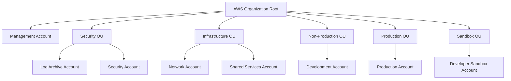
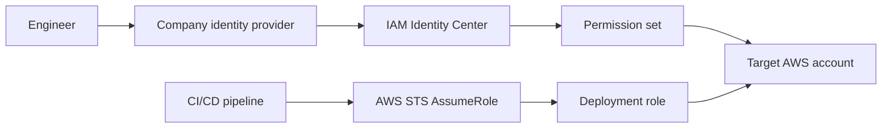
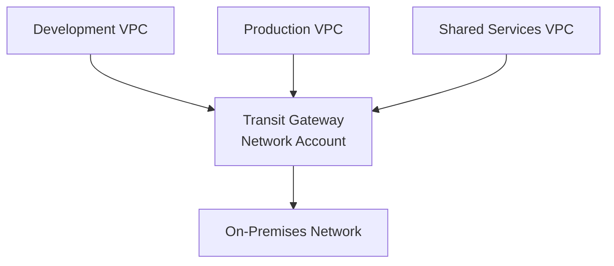
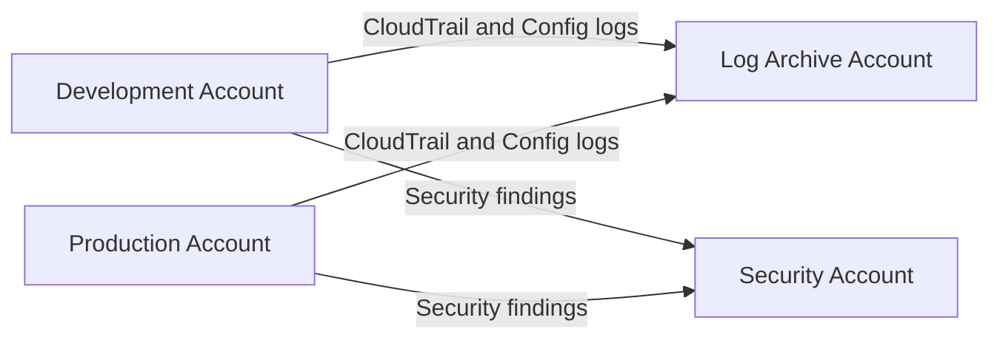
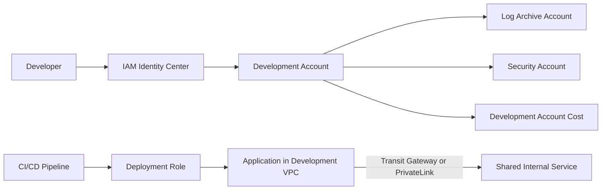

# AWS Multi-Account Basics

## 1. Overview

An AWS account is more than a billing container. It is also a strong boundary for:

- Permissions
- Resources
- Billing
- Service quotas
- Security boundaries
- Operational ownership

Companies usually avoid placing every environment and shared service inside one account because the blast radius is too large.

```text
One AWS account
├── Development resources
├── Production resources
├── Security tooling
├── Shared services
└── Administrative resources
```

This becomes hard to manage: development is too close to production, shared tools can affect workloads, logs can be changed by their source accounts, and billing ownership is unclear.

A multi-account structure separates responsibilities:

```text
AWS Organization
├── Security accounts
├── Infrastructure accounts
├── Development accounts
└── Production accounts
```

## 2. AWS Organizations

AWS Organizations centrally manages AWS accounts. It lets a company create accounts, group accounts, apply organization-level policies, enable supported AWS services centrally, and receive one consolidated bill.

- Central management of AWS accounts
- Organizational Units
- Consolidated billing
- Service Control Policies
- Central service integrations
- Account creation and grouping

> AWS Organizations manages the account structure, but it does not automatically configure every resource inside each account.

Creating a Production OU does not automatically create VPCs, IAM roles, CloudTrail trails, GuardDuty settings, or deployment roles.

AWS Control Tower is optional. It helps create and govern a landing zone.

| Service             | Main purpose                                      |
| ------------------- | ------------------------------------------------- |
| AWS Organizations   | Organizes and governs AWS accounts                |
| AWS Control Tower   | Helps create and maintain a governed landing zone |
| IAM Identity Center | Provides centralized human access to accounts     |

## 3. Basic organizational structure



Reference structure:

```text
AWS Organization Root
│
├── Security OU
│   ├── Log Archive Account
│   └── Security Account
│
├── Infrastructure OU
│   ├── Network Account
│   └── Shared Services Account
│
├── Non-Production OU
│   └── Development Account
│
├── Production OU
│   └── Production Account
│
└── Sandbox OU
    └── Developer Sandbox Account
```

The Management Account owns the organization. Keep it mostly empty.

This is only a starting point. Real organizations may add accounts for different applications, teams, environments, compliance boundaries, or business units. Avoid a complex OU tree before there is a real need.

> **Optional screenshot:** AWS Organizations account and OU structure.
>
> Suggested path: `assets/aws-multi-account/organizations.png`

## 4. Account responsibilities

| Account | Purpose | Typical resources |
| ------- | ------- | ----------------- |
| Management Account | AWS Organizations, consolidated billing, Control Tower, delegated administrator setup | Organization settings, billing settings, Control Tower settings |
| Log Archive Account | Central storage for logs from other accounts | CloudTrail logs, AWS Config data, security and audit records |
| Security Account | Central security findings and monitoring | Security Hub, GuardDuty, Inspector, Config aggregation |
| Network Account | Central network infrastructure | Transit Gateway, shared connectivity, VPN or Direct Connect, DNS or egress |
| Shared Services Account | Shared internal tools | CI/CD services, artifact repositories, monitoring, DNS or identity integrations |
| Development Account | Development and testing | Non-production applications, lower-risk changes, non-production data |
| Production Account | Production applications | Production services, databases, restricted access, stronger controls |
| Sandbox Account | Experiments and learning | Temporary resources, test services, cost-limited access |

Application workloads should not run in the Management Account.

Some organizations use a separate Platform or CI/CD account.

## 5. Organizational Units

An Organizational Unit, or OU, groups accounts that should receive similar controls.

```text
Production OU
├── payments-production
├── customer-portal-production
└── reporting-production
```

Policies should normally be attached to an OU instead of repeatedly configuring each account.

An OU is a governance grouping:

- An OU is not a network boundary.
- An OU is not an IAM role.
- An OU does not connect accounts.
- An OU is mainly a way to group accounts for policy and administration.

## 6. Service Control Policies

Service Control Policies, or SCPs, are organization-level guardrails.

> An SCP defines the maximum permissions available inside an account. It does not grant permissions.

If an SCP denies an action, no IAM user or role in the affected account can perform it. If an SCP allows an action, the user or role still needs IAM permissions.

Simple SCP use cases:

- Prevent accounts from leaving the organization
- Restrict use of unapproved AWS Regions
- Prevent disabling CloudTrail
- Prevent modification of central security services
- Restrict dangerous actions in sandbox accounts

Simplified learning example. Test and adapt before real use.

```json
{
  "Version": "2012-10-17",
  "Statement": [
    {
      "Sid": "DenyCloudTrailDisable",
      "Effect": "Deny",
      "Action": [
        "cloudtrail:DeleteTrail",
        "cloudtrail:StopLogging",
        "cloudtrail:UpdateTrail"
      ],
      "Resource": "*"
    }
  ]
}
```

Test SCPs first on a test account or Policy Staging OU.

## 7. Access between accounts

Handle human access and automation access separately.

### Human access

```text
Engineer
  -> Company identity provider
  -> IAM Identity Center
  -> Permission set
  -> Target AWS account
```

Users sign in once, select an AWS account and role, and receive temporary credentials. Different teams receive different permission sets. Avoid long-lived IAM users for workforce access.

| Team                 | Access                               |
| -------------------- | ------------------------------------ |
| Developers           | Development accounts                 |
| Platform team        | Infrastructure and workload accounts |
| Security team        | Security access across accounts      |
| Production operators | Restricted production access         |
| Finance              | Billing visibility                   |

### Automation access

```text
CI/CD Pipeline
  -> AWS STS AssumeRole
  -> Deployment role
  -> Target AWS account
```

The pipeline usually runs in a platform or shared-services account. Each target account contains a deployment role that the pipeline assumes temporarily.

Production and development roles should have different permissions. Avoid permanent access keys when role-based access is possible.



> **Optional screenshot:** IAM Identity Center account assignments.
>
> Suggested path: `assets/aws-multi-account/identity-center.png`

## 8. Basic connectivity between accounts

AWS accounts are isolated by default. Resources in one account do not automatically communicate with another account.

Connectivity is usually created between VPCs, shared subnets, or specific private services. The AWS account itself is not connected directly. Its VPC, subnet, endpoint, or service is connected.

| Connectivity option  | Typical use                                                |
| -------------------- | ---------------------------------------------------------- |
| VPC Peering          | Direct connection between a small number of VPCs           |
| Transit Gateway      | Central connectivity for many VPCs and accounts            |
| AWS PrivateLink      | Private access to a specific service                       |
| Shared VPC           | Central network account shares subnets with other accounts |
| VPN / Direct Connect | Connectivity to an on-premises network                     |

Transit Gateway is a common hub-and-spoke model.



Basic flow:

1. The Transit Gateway is created in the Network Account.
2. It is shared with other accounts through AWS Resource Access Manager.
3. Development and production accounts attach their VPCs.
4. Transit Gateway route tables define which networks may communicate.
5. Production and development do not have to communicate directly.
6. Traffic may pass through a central inspection or firewall VPC.

Route tables, security groups, Network ACLs, DNS, and firewall policies must also allow the traffic.

For a deeper explanation of AWS networking options, routing patterns and connectivity trade-offs, see [AWS Connectivity Options](aws-connectivity-options.md).

> **Optional screenshot:** Transit Gateway attachments.
>
> Suggested path: `assets/aws-multi-account/transit-gateway.png`

## 9. Central logging and security

Central logging keeps audit records away from source accounts. Central security aggregation gives security teams one place to review findings.



CloudTrail records AWS API activity. AWS Config records resource configuration and changes.

GuardDuty, Security Hub, and Inspector findings are commonly aggregated in the Security Account. Supported services can use delegated administration. New accounts should be enrolled automatically where possible.

## 10. Starting from zero

Use phases.

### Phase 1: Plan

Decide:

- Account names
- Account email strategy
- AWS Regions
- OU structure
- Network CIDR ranges
- Identity provider
- Logging retention
- Required security services
- Cost ownership and tags

### Phase 2: Create the organization

- Secure the Management Account
- Enable AWS Organizations
- Create the initial OUs
- Create the foundational accounts
- Optionally deploy AWS Control Tower

### Phase 3: Configure access

- Enable IAM Identity Center
- Create groups
- Create permission sets
- Assign access to accounts
- Configure emergency access

### Phase 4: Configure security and logging

- Create an organization CloudTrail
- Configure AWS Config
- Configure the Log Archive Account
- Delegate security services
- Enable GuardDuty and Security Hub
- Configure alerts

### Phase 5: Configure networking

- Allocate CIDR ranges
- Create the Network Account
- Create Transit Gateway if needed
- Attach workload VPCs
- Configure routes and DNS
- Test allowed and denied connectivity

### Phase 6: Create workload accounts

- Create Development and Production accounts
- Apply baseline policies
- Configure budgets
- Configure logging
- Configure deployment roles
- Connect VPCs where required

### Phase 7: Automate

Account provisioning and baselines can later be automated using:

- Control Tower Account Factory
- Account Factory for Terraform
- Terraform
- CloudFormation
- CI/CD pipelines

## 11. Example request flow

Scenario: a developer deploys an application into the Development Account.

1. Developer signs in through IAM Identity Center.
2. Developer selects the Development Account.
3. CI/CD pipeline builds the application.
4. Pipeline assumes a deployment role in the Development Account.
5. Application is deployed into the Development VPC.
6. The application accesses a shared internal service through Transit Gateway or PrivateLink.
7. CloudTrail and Config data are sent to the Log Archive Account.
8. Security findings are sent to the Security Account.
9. Cost is reported under the Development Account.



## 12. What should remain separate

| Resource or responsibility  | Recommended location    |
| --------------------------- | ----------------------- |
| Organization administration | Management Account      |
| Central logs                | Log Archive Account     |
| Security findings           | Security Account        |
| Transit Gateway             | Network Account         |
| Shared tooling              | Shared Services Account |
| Development workloads       | Development Account     |
| Production workloads        | Production Account      |
| Experiments                 | Sandbox Account         |

- Production and development should not share the same account.
- Logs should not be stored only in the account that generates them.
- CI/CD should not use administrator credentials across every account.
- The Management Account should remain mostly empty.

## 13. Common mistakes

- Using only one AWS account
- Running workloads in the Management Account
- Creating too many OUs too early
- Connecting every VPC to every other VPC
- Allowing development access to production
- Using long-lived IAM access keys
- Applying SCPs without testing
- Forgetting central logging
- Using overlapping VPC CIDR ranges
- Creating accounts manually without a standard baseline
- Not assigning an owner and cost center to each account

## 14. Final architecture summary

```text
AWS Organizations
├── Management Account
├── Security OU
│   ├── Log Archive
│   └── Security
├── Infrastructure OU
│   ├── Network
│   └── Shared Services
├── Non-Production OU
│   └── Development
├── Production OU
│   └── Production
└── Sandbox OU
    └── Sandbox
```

Access and connectivity model:

```text
Human access:
IAM Identity Center -> Permission Set -> AWS Account

Automation:
CI/CD -> STS AssumeRole -> Deployment Role

Network:
Workload VPC -> Transit Gateway -> Shared Services or other approved networks

Logging:
Member Account -> Log Archive Account

Security:
Member Account -> Security Account
```

Start with clear account boundaries, central access, central logging, and a small OU structure.

## References

- [AWS Organizations](https://docs.aws.amazon.com/organizations/latest/userguide/orgs_introduction.html)
- [AWS Control Tower](https://docs.aws.amazon.com/controltower/latest/userguide/what-is-control-tower.html)
- [IAM Identity Center](https://docs.aws.amazon.com/singlesignon/latest/userguide/what-is.html)
- [Service Control Policies](https://docs.aws.amazon.com/organizations/latest/userguide/orgs_manage_policies_scps.html)
- [AWS Transit Gateway](https://docs.aws.amazon.com/vpc/latest/tgw/what-is-transit-gateway.html)
- [AWS Resource Access Manager](https://docs.aws.amazon.com/ram/latest/userguide/what-is.html)
- [Organization CloudTrail](https://docs.aws.amazon.com/awscloudtrail/latest/userguide/creating-trail-organization.html)
- [AWS Config aggregation](https://docs.aws.amazon.com/config/latest/developerguide/aggregate-data.html)
- [GuardDuty delegated administrator](https://docs.aws.amazon.com/guardduty/latest/ug/guardduty_organizations.html)
- [Security Hub central configuration](https://docs.aws.amazon.com/securityhub/latest/userguide/central-configuration-intro.html)
