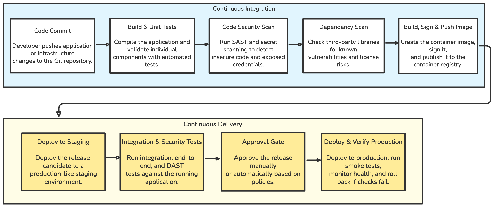

# CI/CD Standards

This document defines the standard structure, quality gates, and deployment practices for CI/CD pipelines.

## Pipeline Principles

*   **Consistency:** All pipelines should follow a similar structure.
*   **Security:** Secrets are never stored in Git; scans are integrated.
*   **Feedback:** Pipelines should fail fast and provide clear errors.
*   **Automation:** Deployments to non-production should be fully automated.

## Branching & Pull Requests

*   **Main-based Development:** Feature branches merge into `main`.
*   **Short-lived Branches:** Merge at least every 2-3 days.
*   **PR Rules:** Require at least one approval and passing CI checks.

## Recommended Pipeline Flow

  

## Minimum Pipeline Standard

Every production pipeline should include:

- Pull request approval and passing CI checks.
- Build and unit test validation.
- Code security, secret, and dependency scanning.
- Signed, immutable container image published to a private registry.
- Staging deployment using the same artifact intended for production.
- Integration, security, and production smoke tests.
- Manual or policy-based approval before production deployment.
- Deployment events sent to observability and incident management tools.

## Continuous Integration

### 1. Code Commit

Developers push application or infrastructure changes to Git through short-lived branches and pull requests.

### 2. Build & Unit Tests

Compile the application, install dependencies, run linting, and validate individual components with automated unit tests.

### 3. Code Security Scan

Run SAST and secret scanning. Critical findings or exposed credentials should fail the pipeline.

### 4. Dependency Scan

Check third-party libraries for known vulnerabilities and license risks before packaging.

### 5. Build, Sign & Push Image

Create the container image, sign it, and publish it to a private registry. The produced image must be immutable and reused across environments.

## Continuous Delivery

### 6. Deploy to Staging

Deploy the release candidate to a production-like staging environment using the same image intended for production.

### 7. Integration & Security Tests

Run integration, end-to-end, DAST, and smoke tests against the running application.

### 8. Approval Gate

Approve the release manually or automatically based on policy, test results, and risk level.

### 9. Deploy & Verify Production

Deploy to production, run smoke tests, monitor health, and roll back if validation fails.

For deployments that may cause expected restarts or temporary service degradation, the pipeline may automate a short maintenance window or monitoring downtime. It must target only the affected service, start immediately before deployment, expire automatically, and must not suppress unrelated critical alerts.

## Secrets Handling

> [!WARNING]
> Secrets must not be stored in Git, pipeline logs, or plain-text pipeline variables. Use a dedicated secret manager and inject them at runtime.

## Pipeline Observability

- Track pipeline success rates and duration.
- Ensure deployment events are sent to central observability tools.
