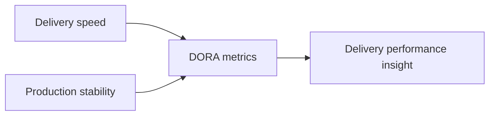
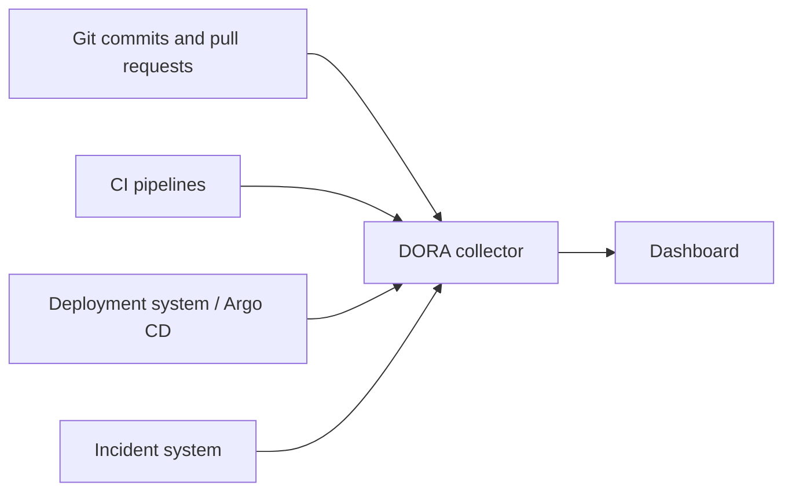
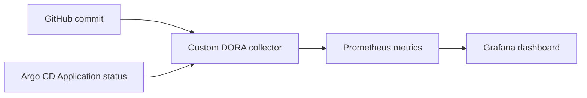
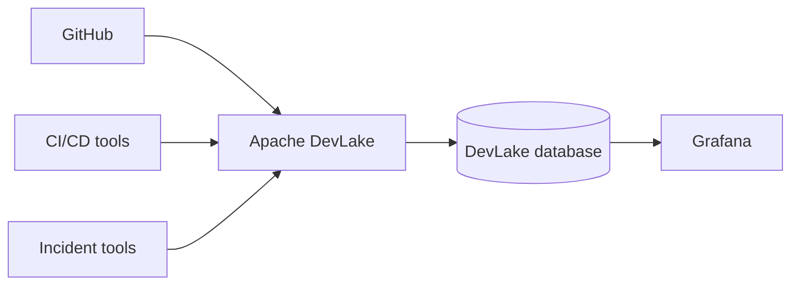
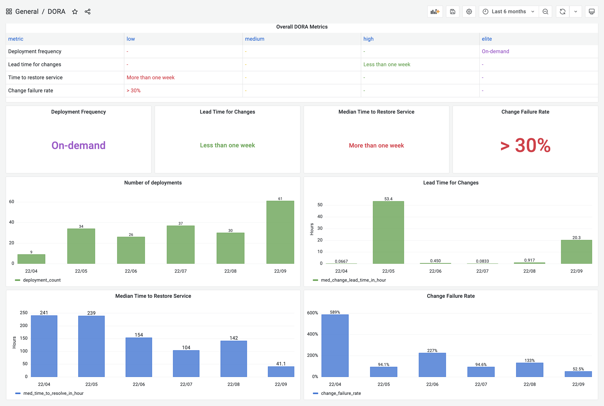
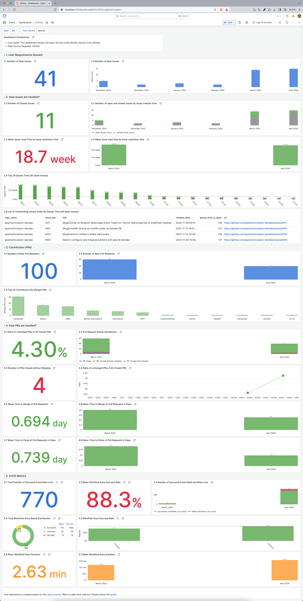

# DORA Metrics

## Purpose

This document explains what DORA metrics are, what they measure, where the data usually comes from, and which implementation options are commonly used.

It is intended for engineers who want to understand delivery performance without turning the topic into a full observability or platform engineering project.

DORA metrics are useful when they help teams understand software delivery flow. They are not useful when they are used as individual performance scores.

---

## What are DORA metrics?

DORA metrics are a small set of software delivery metrics used to understand how quickly and safely teams deliver changes to production.

The classic four metrics are:

| Metric | What it measures | Main question |
| --- | --- | --- |
| Deployment Frequency | How often changes reach production | How often do we deploy? |
| Lead Time for Changes | Time from code change to production | How long does delivery take? |
| Change Failure Rate | Percentage of deployments causing failure | How often do changes break production? |
| Time to Restore Service | Time to recover after failure | How quickly do we recover? |

Some newer DORA models also include reliability as an additional dimension, but many tools and dashboards still focus on the classic four metrics.

---

## Why they matter

DORA metrics are useful because they connect delivery speed with operational stability.

A team that deploys often but breaks production constantly is not performing well.

A team that is stable but can only release once every few months may also have a delivery problem.

The useful signal comes from looking at the metrics together.



---

## Metric details

### Deployment Frequency

Measures how often successful deployments reach production.

Typical source:

* deployment system
* GitOps controller
* CI/CD deployment records
* release management tool

Example:

```text
15 production deployments in the last 7 days
```

---

### Lead Time for Changes

Measures how long it takes for a code change to reach production.

Typical source:

* Git commit or pull request timestamp
* deployment completion timestamp

Example:

```text
commit created at 10:00
deployment completed at 11:30
lead time = 90 minutes
```

---

### Change Failure Rate

Measures how many deployments cause production failure.

Typical source:

* deployment records
* incidents
* rollbacks
* hotfixes
* failed health checks

Example:

```text
10 deployments
2 caused incidents
change failure rate = 20%
```

---

### Time to Restore Service

Measures how long recovery takes after a failed change or incident.

Typical source:

* incident start timestamp
* incident resolved timestamp
* service health recovery timestamp

Example:

```text
incident started at 14:05
service restored at 14:40
restore time = 35 minutes
```

---

## Data sources

DORA metrics usually require data from more than one system.



Common sources:

| Source | Provides |
| --- | --- |
| GitHub / GitLab / Bitbucket | commits, pull requests, timestamps |
| Jenkins / GitHub Actions / GitLab CI | build and pipeline data |
| Argo CD / Flux / Spinnaker | deployment state and production revisions |
| Jira / PagerDuty / Opsgenie | incidents and recovery data |
| Prometheus / Grafana | visualization and operational context |

---

## Implementation options

There is no single correct implementation. The right option depends on toolchain complexity.

| Option | Best for | Notes |
| --- | --- | --- |
| GitLab built-in DORA metrics | Teams using GitLab for Git, CI and deployments | Simple when the whole lifecycle is inside GitLab |
| Apache DevLake | Mixed toolchains | Collects data from multiple engineering tools and visualizes it in Grafana |
| Harness / LinearB / Swarmia | Larger organizations | Commercial engineering intelligence platforms |
| Custom collector | Focused internal use cases | Useful when the data model is simple and specific |
| SQL / warehouse approach | Data-heavy organizations | Good when events already exist in BigQuery, Snowflake or PostgreSQL |

---

## Example: GitHub + Argo CD + collector

A simple custom implementation can collect commit data from GitHub and deployment state from Argo CD.



This approach is useful for learning the model, but it is not a replacement for a complete production analytics platform.

---

## Example: Apache DevLake

Apache DevLake is an open-source option for collecting engineering data from multiple tools and presenting DORA-style dashboards.





Apache DevLake can be useful when the organization has multiple tools and needs one place to correlate Git, CI/CD, deployment and incident data.



Build and CI metrics are not the same as DORA metrics, but they are often displayed next to DORA dashboards to help explain delivery bottlenecks.

---

## When DORA works well

DORA metrics work well when:

* deployments are recorded consistently
* production environments are clearly defined
* incidents are tracked honestly
* teams use the metrics for improvement
* metrics are reviewed together, not in isolation

Good use:

```text
Lead time increased. Let's inspect review time, pipeline time and deployment wait time.
```

Bad use:

```text
Team A has fewer deployments than Team B, so Team A is worse.
```

---

## When DORA can be misleading

DORA metrics can be misleading when:

* deployment events are not reliable
* incidents are not consistently recorded
* different teams have very different release models
* metrics are used to rank individuals
* teams optimize the metric instead of the system

Example problems:

| Problem | Result |
| --- | --- |
| Counting staging deployments as production | Deployment frequency looks inflated |
| Ignoring small incidents | Change failure rate looks better than reality |
| Comparing unrelated teams | Metrics lose context |
| Measuring only CI success | Production delivery is not measured |

---

## Practical guidance

Start with the simplest reliable data source.

If the organization uses GitLab for source control, CI and deployments, built-in GitLab DORA metrics may be enough.

If the organization uses GitHub, Argo CD and a separate incident system, a collector or platform such as Apache DevLake may be more appropriate.

If the organization already has a data warehouse, DORA metrics can be calculated there from existing events.

The important part is not the tool. The important part is consistent event correlation:

```text
change created
  -> deployment completed
  -> failure detected
  -> service restored
```

---

## References

* DORA research: https://dora.dev/
* GitLab DORA metrics: https://docs.gitlab.com/user/analytics/dora_metrics/
* Apache DevLake DORA metrics: https://devlake.apache.org/docs/DORA/
* Apache DevLake: https://devlake.apache.org/
* Argo CD metrics: https://argo-cd.readthedocs.io/en/stable/operator-manual/metrics/
* GitHub deployments API: https://docs.github.com/en/rest/deployments/deployments
