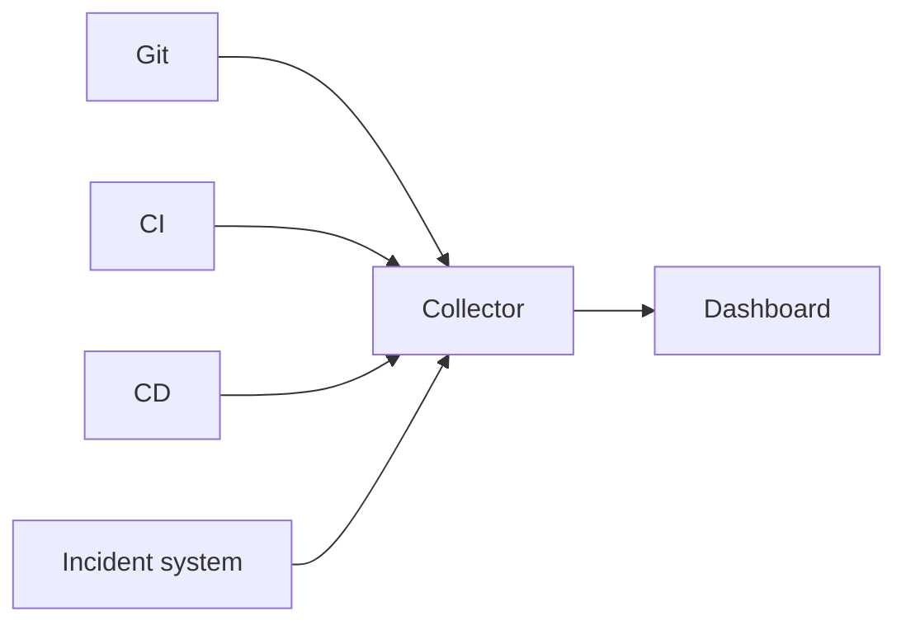
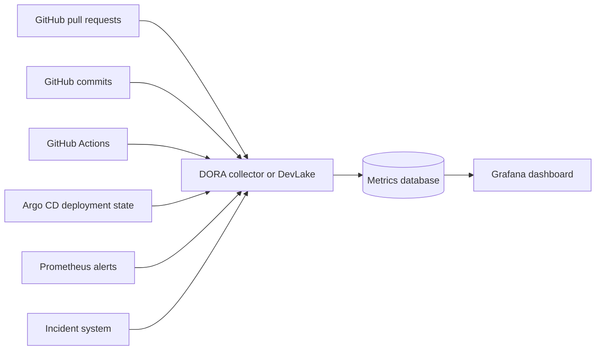
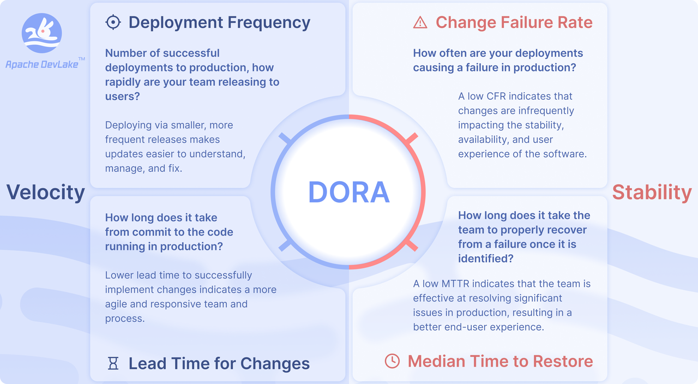

# DORA Metrics

## Purpose

This document explains how to use DORA metrics to measure software delivery performance. It belongs in this repository because the existing CI/CD and GitOps examples describe delivery workflows, while DORA metrics describe how those workflows can be measured.

## Overview

DORA metrics are a small set of delivery measurements from the DevOps Research and Assessment program. They help teams understand whether software changes move to production quickly and whether those changes are stable after release.

The classic model uses four metrics: two for throughput and two for stability. Current DORA guidance also discusses a five-metric model and renames the old recovery metric to failed deployment recovery time. This document uses the classic four-metric model because it is still widely used by GitLab, DevLake, Harness, LinearB, Swarmia, and custom dashboards.

## Metrics

| Metric | What it measures | Typical source |
| --- | --- | --- |
| Deployment Frequency | How often successful production deployments happen. | CD system, GitOps controller, deployment events |
| Lead Time for Changes | Time from code commit or merged change to successful production deployment. | Git, pull requests, CI/CD, deployment events |
| Change Failure Rate | Percentage of production deployments that cause an incident, rollback, hotfix, or immediate remediation. | Deployment events, incident system, rollback records |
| Time to Restore Service | Time needed to restore service after a production failure caused by a change. | Incident system, monitoring alerts, deployment records |

## How Data Is Collected

The collector normalizes events into a shared model: changes, builds, deployments, incidents, and recovery events. The dashboard then calculates metrics per service, team, repository, or environment.

Only production deployments should normally count for DORA. Staging deployments are useful for debugging delivery flow, but they distort the delivery-performance signal if mixed with production data.

## Implementation Options

| Option | Best fit | Notes |
| --- | --- | --- |
| GitLab built-in | Teams already using GitLab CI/CD and GitLab environments. | Lowest setup effort if deployments and incidents are already tracked in GitLab. |
| Apache DevLake | Teams that want an open-source collector and Grafana dashboards across multiple tools. | Good fit when data comes from GitHub, GitLab, Jenkins, Jira, webhooks, or mixed CI/CD systems. |
| Harness / LinearB / Swarmia | Teams that want a managed engineering metrics product. | Faster setup, less SQL ownership, usually paid and tied to product-specific definitions. |
| Custom collector | Teams with unusual delivery systems or strict data ownership needs. | Keep it small: ingest events, normalize IDs, calculate the four metrics, publish to Grafana or BI. |
| Manual / SQL approach | Early baseline, audit, or one-off analysis. | Useful to validate definitions before buying or building a platform; weak for ongoing reporting. |

## When DORA Works Well

- Services deploy independently and production deployment events are reliable.
- Incidents are linked to services and have clear start and recovery timestamps.
- Teams use the same definitions for production, deployment, incident, rollback, and hotfix.
- Metrics are reviewed as trends, not as individual developer performance scores.

## When DORA Is Misleading

- Deployments are batched across many unrelated services.
- Production environments are not clearly separated from staging or test.
- Incidents are underreported, merged together, or not linked to deployments.
- Lead time starts at inconsistent points, such as first commit for one team and merge time for another.
- Metrics are used as targets without context, which encourages gaming instead of improvement.

## Example Architecture

This example uses GitHub for source control, GitHub Actions for CI, Argo CD for deployment, and Prometheus/Grafana for operational visibility. DevLake can replace the custom collector if its built-in integrations fit the toolchain.

Minimum event model:

- Change: commit SHA, pull request ID, repository, author, merge time.
- Deployment: service, environment, deployment time, version or commit SHA, status.
- Incident: service, start time, recovery time, linked deployment or suspected deployment.

## Screenshots

These screenshots are copied from official GitLab and Apache DevLake documentation pages. Keep the source links beside the images so future updates can verify licensing and freshness.

### GitLab

Source: [GitLab Value Streams Dashboard documentation](https://docs.gitlab.com/user/analytics/value_streams_dashboard/)

### Apache DevLake

Source: [Apache DevLake DORA documentation](https://devlake.apache.org/docs/DORA/)

## References

- [DORA software delivery performance metrics](https://dora.dev/guides/dora-metrics/)
- [A history of DORA's software delivery metrics](https://dora.dev/insights/dora-metrics-history/)
- [Four Keys project](https://github.com/dora-team/fourkeys)
- [GitLab DORA metrics](https://docs.gitlab.com/user/analytics/dora_metrics/)
- [GitLab Value Streams Dashboard](https://docs.gitlab.com/user/analytics/value_streams_dashboard/)
- [Apache DevLake DORA](https://devlake.apache.org/docs/DORA/)
- [Argo CD metrics](https://argo-cd.readthedocs.io/en/stable/operator-manual/metrics/)
- [Swarmia: how PRs are linked to deployments](https://help.swarmia.com/track-dora-metrics/how-swarmia-links-prs-to-deployments)
- [LinearB metrics glossary](https://linearb.helpdocs.io/article/sth7bn9zrd-metrics-glossary-html)
