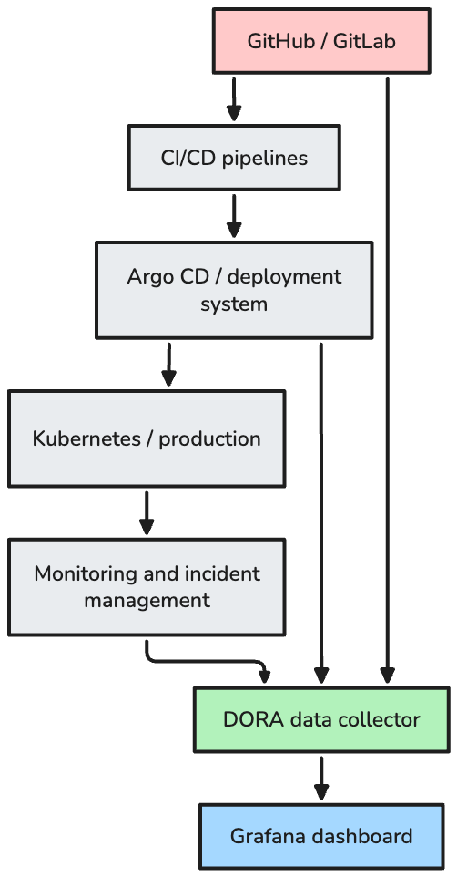

# DORA Metrics

DORA metrics are a small set of delivery and reliability measures used to understand how well software changes move from code to production.

This document is for engineering managers, team leads, and technical leads who need a practical introduction before adopting DORA reporting.

The metrics matter because they connect delivery speed with operational stability. They help leaders see whether teams can release changes frequently, move work through the delivery system without long delays, recover from failed changes, and maintain reliable services.

DORA metrics are team and system metrics. They should be used to improve delivery flow, not to rank individual engineers.

## Table of Contents

* [The Four Metrics](#the-four-metrics)
* [Deployment Frequency](#deployment-frequency)
* [Change Lead Time](#change-lead-time)
* [Change Fail Rate](#change-fail-rate)
* [Failed Deployment Recovery Time](#failed-deployment-recovery-time)
* [Reliability](#reliability)
* [Data Flow](#data-flow)
* [Dashboard Example](#dashboard-example)
* [How Managers Should Use the Metrics](#how-managers-should-use-the-metrics)
* [References](#references)

## The Four Metrics

The traditional DORA metrics are:

1. Deployment Frequency
2. Change Lead Time
3. Change Fail Rate
4. Failed Deployment Recovery Time

Together, they show whether delivery is fast, predictable, and safe. A team should review them together because improving one metric while damaging another can create the wrong outcome.

For example, increasing Deployment Frequency is not useful if Change Fail Rate rises sharply. Reducing Change Fail Rate is not enough if changes wait weeks before reaching production.

## Deployment Frequency

Deployment Frequency measures how often changes are deployed to production.

It answers:

```text
How often do we release production changes?
```

Example:

```text
A team deploys 24 times in one week.

Deployment Frequency = 24 production deployments per week
```

Typical data sources:

* Argo CD deployment history
* Kubernetes deployment events
* GitHub Actions or GitLab CI deployment workflows
* Jenkins deployment pipelines
* cloud deployment audit logs

Count production deployments consistently, even when a deployment later requires a rollback or fix.

## Change Lead Time

Change Lead Time measures how long it takes for a code change to reach production.

It answers:

```text
How long does it take to deliver a committed change?
```

Example:

```text
Commit created:        2026-07-20 09:00
Production deployment: 2026-07-20 15:30

Change Lead Time:      6 hours 30 minutes
```

Typical data sources:

* Git commit timestamps
* commit SHA values
* deployment completion timestamps
* release or version metadata
* production environment records

Pull request creation and merge timestamps can be useful internal indicators, but the standard metric starts with the commit and ends with the successful production deployment.

Use medians and percentiles instead of only averages. Averages can hide long delays that affect some teams or services.

## Change Fail Rate

Change Fail Rate measures the percentage of production deployments that cause a failure requiring remediation.

It answers:

```text
How often do production changes require urgent correction?
```

Example:

```text
Total production deployments: 40
Failed deployments:           4

Change Fail Rate:             10%
```

Typical data sources:

* deployment records
* rollback events
* roll-forward fixes
* hotfix records
* incident management systems
* manual remediation notes

A failed health check alone should not automatically count as a failed change unless it causes production impact or requires intervention. Define the failure criteria before reporting this metric.

## Failed Deployment Recovery Time

Failed Deployment Recovery Time measures how long it takes to recover from a failed production deployment.

It answers:

```text
When a deployment causes impact, how quickly do we restore normal service?
```

Example:

```text
Failed deployment detected: 2026-07-20 14:00
Service restored:          2026-07-20 14:35

Recovery time:             35 minutes
```

Typical data sources:

* incident start and recovery timestamps
* deployment timestamps
* rollback or roll-forward records
* monitoring alerts
* customer-impact records

This is not the same as generic incident MTTR. It should include only failures caused by production deployments.

## Reliability

Reliability complements the four delivery metrics by showing whether services meet their operational targets.

Common reliability measures include:

* availability
* request success rate
* latency objectives
* error budget consumption
* incident impact
* service level objective compliance

Delivery speed should not improve at the expense of reliability. A team that deploys quickly but burns error budget or creates repeated customer impact has not improved the delivery system.

## Data Flow

DORA reporting usually requires data from source control, CI/CD, deployment systems, production platforms, monitoring, and incident management.



The exact tooling can vary. The important part is consistent event correlation: which change was deployed, when it reached production, whether it caused a failure, and when service recovered.

## Dashboard Example


Attribution: screenshot from the Apache DevLake DORA documentation. See [Apache DevLake DORA metrics](https://devlake.apache.org/docs/DORA/).

A useful dashboard should show the current reporting period and trends over time. It should also allow filtering by service, team, repository, environment, and date range.

## How Managers Should Use the Metrics

Use DORA metrics to improve the delivery system, not to judge individual engineers.

Review trends rather than isolated values. A single bad week may reflect an incident, migration, freeze period, or unusual release. Trends show whether the system is improving or getting worse.

Use the metrics to identify delivery bottlenecks. Long Change Lead Time may point to slow review, long-running pipelines, deployment queues, manual approvals, or release coordination overhead.

Balance delivery speed, stability, and reliability. Higher Deployment Frequency is valuable only when Change Fail Rate, recovery time, and reliability remain healthy.

Never use DORA metrics to rank individual engineers. The metrics reflect team practices, architecture, automation, review flow, deployment safety, and operational readiness.

## References

* [DORA Research](https://dora.dev/research/)
* [DORA Metrics Guide](https://dora.dev/guides/dora-metrics/)
* [Apache DevLake DORA metrics](https://devlake.apache.org/docs/DORA/)
* [Google Cloud DevOps Research and Assessment](https://cloud.google.com/devops)
