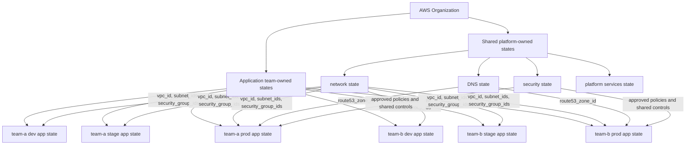

# Terraform State Separation in Large AWS Organizations

## Problem Statement

In a large AWS organization, one Terraform state file for all accounts, environments, teams, and resources creates operational risk. Terraform state is not just a cache; it is the source Terraform uses to decide what it owns and what it can change.

If networking, DNS, IAM, databases, shared security controls, and application workloads all live in one state, one bad plan or incorrect apply can affect resources owned by other teams. A routine application change should not be able to modify production VPCs, Route 53 zones, IAM baselines, databases, or shared platform services.

State should be separated by ownership, environment, and blast radius.

## Example Organization

Example setup:

- 30 AWS accounts
- dev, stage, and prod environments
- 15 application teams
- shared platform-owned accounts, such as:
  - `shared-network-prod`
  - `shared-security-prod`
  - `shared-dns-prod`
  - `app-team-a-dev`
  - `app-team-a-stage`
  - `app-team-a-prod`
  - `app-team-b-dev`
  - `app-team-b-stage`
  - `app-team-b-prod`

The more accounts, teams, and environments you have, the less practical a single Terraform state becomes. More accounts increase the number of trust boundaries. More teams increase the number of owners. Multiple environments increase the need to protect production from lower-environment changes.

Terraform state must follow those boundaries. Separate state by who owns the infrastructure, where it runs, and how much damage a bad change could cause.

## Recommended State Separation

| State domain | Owner | Typical resources | Change frequency | Why separate it |
| --- | --- | --- | --- | --- |
| organization / baseline | Platform team | AWS Organizations, OUs, account vending, SCP attachment, baseline tags | Low | This is foundational infrastructure. A mistake can affect many or all accounts. |
| IAM / identity | Security team, with platform support | IAM Identity Center, permission sets, cross-account roles, baseline IAM policies | Low to medium | Access control changes need tight review and should not be coupled to application deploys. |
| networking | Platform networking team | VPCs, subnets, transit gateways, route tables, NAT gateways, VPC endpoints | Low to medium | Networking has a large blast radius and is consumed by many teams. |
| DNS | Platform or DNS team | Route 53 hosted zones, delegated zones, resolver rules, shared records | Medium | DNS mistakes can break production traffic across many applications. |
| security | Security team | GuardDuty, Security Hub, AWS Config, CloudTrail, KMS baselines, security account integrations | Low to medium | Security controls must be managed independently from workloads they monitor or protect. |
| observability | Platform observability team | Central log buckets, CloudWatch baselines, dashboards, alarms, OpenSearch or monitoring integrations | Medium | Shared monitoring should not be changed by individual application deployments. |
| databases | Database platform team or owning app team, depending on scope | RDS, Aurora, DynamoDB tables, parameter groups, subnet groups, backups | Medium | Databases carry data-loss risk and often need stricter approval than stateless app resources. |
| platform services | Platform team | EKS clusters, CI/CD runners, shared ALBs, service mesh, artifact repositories | Medium | Shared runtime services affect many application teams and need platform ownership. |
| application stacks | Application teams | ECS services, Lambda functions, app-specific security groups, queues, buckets, alarms | High | App teams need autonomy, but only within their own account, environment, and workload boundary. |

## Ownership Model

The platform team owns baseline infrastructure: account structure, remote backend standards, networking foundations, shared runtime platforms, and common deployment patterns.

The security team owns guardrails and core IAM/security policies: identity baselines, security services, policy boundaries, audit logging, and controls that apply across accounts.

Application teams own only their application-stack Terraform. That usually means service infrastructure such as compute, app-specific security groups, queues, buckets, alarms, and permissions needed by that application.

Application teams should consume shared outputs instead of modifying shared infrastructure directly. For example, an app team can read the VPC ID and subnet IDs from network state, but it should not edit the VPC state to add routes, subnets, or shared security groups.

## Remote State Flow

Network state commonly exposes outputs such as:

- `vpc_id`
- `private_subnet_ids`
- `public_subnet_ids`
- `shared_security_group_ids`
- `route53_zone_id`

Application stack state consumes those values through `terraform_remote_state` or a controlled parameter source such as AWS Systems Manager Parameter Store. Remote state is simple, but it exposes all root outputs from the source state. Use a parameter source when you need a narrower, more controlled contract.

Network state output:

```hcl
output "vpc_id" {
  value = aws_vpc.main.id
}

output "private_subnet_ids" {
  value = aws_subnet.private[*].id
}

output "route53_zone_id" {
  value = aws_route53_zone.private.zone_id
}
```

Application stack consuming remote state output:

```hcl
data "terraform_remote_state" "network" {
  backend = "s3"

  config = {
    bucket = "company-terraform-state-prod"
    key    = "network/prod/terraform.tfstate"
    region = "us-east-1"
  }
}

module "app" {
  source = "../../../modules/app-service"

  vpc_id             = data.terraform_remote_state.network.outputs.vpc_id
  private_subnet_ids = data.terraform_remote_state.network.outputs.private_subnet_ids
  route53_zone_id    = data.terraform_remote_state.network.outputs.route53_zone_id
}
```

## IAM Model

Use least privilege for Terraform execution roles.

- Platform team roles can manage shared platform states.
- Security team roles can manage guardrails, audit controls, and core security states.
- Application team roles can deploy only their own application resources.
- Application teams should not be able to modify VPCs, shared DNS zones, IAM baselines, security guardrails, or other teams' resources.
- Terraform execution roles should be scoped per account, environment, and team where possible.

For example, `team-a-prod` should use a production role that can manage only Team A production resources in the Team A production account. It should not be able to assume roles into `shared-network-prod`, `shared-security-prod`, or another team's account.

## Why Not One Global State

One global Terraform state creates predictable problems:

- Large blast radius: one plan can touch unrelated teams, accounts, or production resources.
- Slow plans: Terraform must refresh and evaluate too many resources.
- State lock contention: teams block each other while waiting for the same state lock.
- Difficult ownership: no single team can safely approve every change in the state.
- Accidental production damage: lower-risk changes can accidentally affect production infrastructure.
- Harder access control: everyone who can apply the state may get access to too much.
- App changes can affect shared infrastructure: a service deploy can unintentionally change VPC, DNS, IAM, or security resources.

A global state file is simple at the start and expensive later. Split state before ownership and production risk make the split painful.

## Practical Folder Example

```text
infra/
├── organization/
├── iam/
├── network/
├── dns/
├── security/
├── observability/
├── platform/
└── apps/
    ├── team-a/
    │   ├── dev/
    │   ├── stage/
    │   └── prod/
    └── team-b/
        ├── dev/
        ├── stage/
        └── prod/
```

Each leaf directory should map to a Terraform root module and a separate backend state. Keep the state boundary obvious from the path.

## Diagram



## Key Principles

- Separate by ownership.
- Separate by environment.
- Separate by blast radius.
- Shared infrastructure is platform-owned.
- App teams consume outputs, not shared state internals.
- Use a remote backend with locking.
- Apply least privilege.
- Version modules.
- Avoid manual AWS console changes.
- Keep Terraform state small enough to reason about safely.
