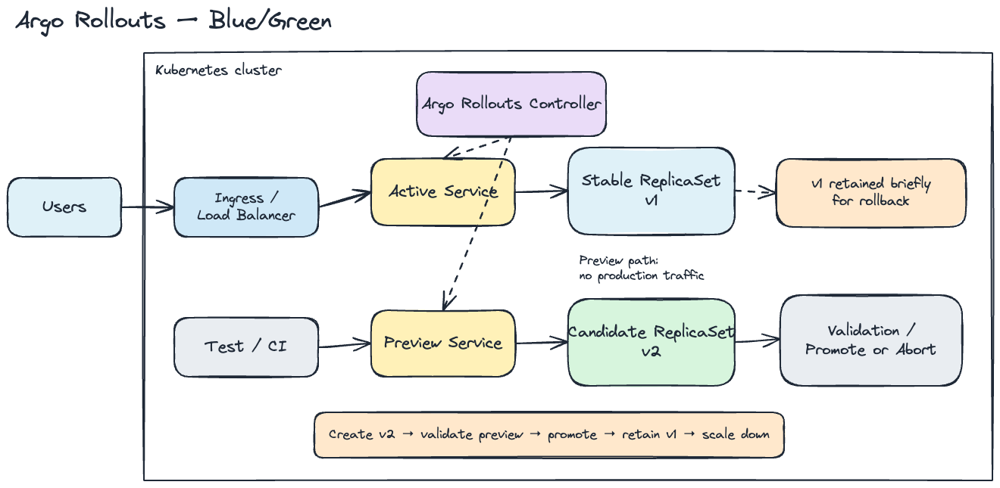
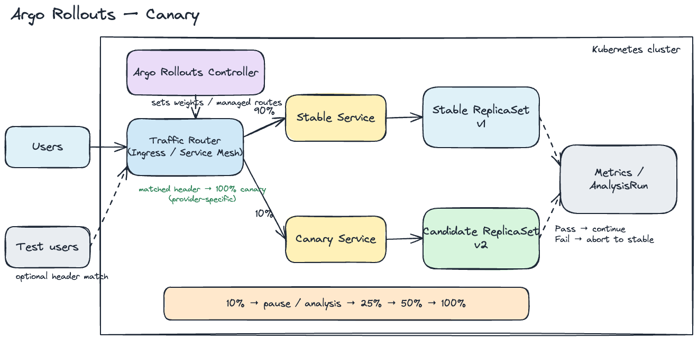
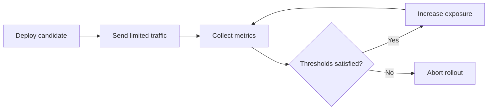

# Argo Rollouts

This document explains Argo Rollouts at a conceptual level. It covers what it adds to Kubernetes, how Blue/Green and Canary rollouts work, how traffic moves between versions, and what to watch operationally.

It focuses on rollout behaviour, traffic management, analysis, experiments, aborts, rollback, and Argo CD integration. It is not an installation guide or a hands-on lab.

## Table of Contents

1. [Overview](#1-overview)
2. [The Problem Argo Rollouts Solves](#2-the-problem-argo-rollouts-solves)
3. [Core Components](#3-core-components)
4. [Deployment Strategies](#4-deployment-strategies)
5. [Blue/Green Deployment](#5-bluegreen-deployment)
6. [Canary Deployment](#6-canary-deployment)
7. [Traffic Management](#7-traffic-management)
8. [Rollout Steps and Pauses](#8-rollout-steps-and-pauses)
9. [Analysis and Automated Validation](#9-analysis-and-automated-validation)
10. [Experiments](#10-experiments)
11. [Rollback and Abort Behaviour](#11-rollback-and-abort-behaviour)
12. [Argo Rollouts and Argo CD](#12-argo-rollouts-and-argo-cd)
13. [Operational Considerations](#13-operational-considerations)
14. [Limitations and Common Misconceptions](#14-limitations-and-common-misconceptions)
15. [When to Use Argo Rollouts](#15-when-to-use-argo-rollouts)
16. [Blue/Green Versus Canary](#16-bluegreen-versus-canary)
17. [Summary](#17-summary)
18. [References](#18-references)

## 1. Overview

Argo Rollouts is a Kubernetes controller with custom resources for progressive delivery. Its main resource, `Rollout`, is an alternative to a standard Kubernetes `Deployment`.

Like a Deployment, a Rollout manages ReplicaSets created from a Pod template. Unlike a Deployment, it controls how a candidate ReplicaSet becomes stable through Blue/Green, Canary, pauses, metric analysis, experiments, and traffic routing.

Progressive delivery means exposing a change gradually and validating it before all users receive it.

## 2. The Problem Argo Rollouts Solves

A standard rolling update replaces old pods with new pods and mainly relies on pod readiness. That is useful, but limited: a pod can be ready while the application has bad latency, elevated errors, broken business flows, or version compatibility issues.

Argo Rollouts adds release controls that Deployments do not provide by default:

* staged exposure
* manual approval points
* metric-based promotion
* automated aborts
* stable and candidate version tracking
* integration with ingress controllers and service meshes

The goal is smaller blast radius when a release is bad.

## 3. Core Components

Argo Rollouts has a small required core and several optional pieces. The optional pieces are only needed when the rollout strategy uses them.

Required:

* **Argo Rollouts controller** reconciles Rollouts, ReplicaSets, Services, analysis, experiments, and traffic provider state.
* **`Rollout`** declares the workload and rollout strategy.
* **Stable ReplicaSet** is the current production version.
* **Candidate ReplicaSet** is the new version being introduced.

Strategy-dependent:

* **Active Service** sends production traffic in Blue/Green rollouts.
* **Preview Service** can expose the Blue/Green candidate before promotion.
* **Stable Service** identifies the stable version for traffic-routed Canary.
* **Canary Service** identifies the candidate version for traffic-routed Canary.
* **Ingress controller or service mesh** applies explicit request weights when traffic routing is enabled.

Optional:

* **`AnalysisTemplate`** defines metric checks and success or failure conditions.
* **`AnalysisRun`** is one execution of an analysis template.
* **`Experiment`** runs temporary workloads for validation or baseline-versus-candidate comparison.
* **Argo CD** can apply Rollout resources from Git, but Argo Rollouts controls runtime progression.

## 4. Deployment Strategies

The three common models are RollingUpdate, Blue/Green, and Canary. They differ mainly in how much control they provide over traffic, promotion, rollback, and temporary capacity.

### Kubernetes RollingUpdate

RollingUpdate gradually replaces pods behind the same Service. It is simple and works well when pod readiness is enough release validation.

### Blue/Green

Blue/Green runs stable and candidate versions at the same time. The candidate can be validated through a preview path before production traffic switches to it.

### Canary

Canary exposes the candidate gradually. Each step can pause, run analysis, or increase traffic until the candidate becomes stable.

| Area | RollingUpdate | Blue/Green | Canary |
|---|---|---|---|
| Traffic movement | Same Service, ready pods | Active Service switches versions | Weight or replica share changes step by step |
| Running versions | Overlap during replacement | Two complete versions | Stable and candidate |
| Promotion | Implicit | Explicit cutover | Gradual |
| Rollback | Older revision | Switch back while old version remains | Abort back to stable |
| Extra requirements | Minimal | Extra capacity and Services | Steps, optional metrics and traffic provider |

## 5. Blue/Green Deployment

Blue/Green is useful when a full candidate version should be validated before production cutover.

Flow:

1. Stable version serves production traffic.
2. Candidate ReplicaSet is created.
3. Preview Service points to the candidate.
4. Active Service still points to stable.
5. Candidate is validated.
6. Promotion changes Active Service selection to the candidate.
7. Previous stable version is retained briefly.
8. Previous version is scaled down after the delay.
9. Failed validation stops promotion or aborts the rollout.

<p align="center">
  
</p>

Promotion changes Kubernetes Service selection. It does not move workloads between clusters.

The scale-down delay keeps the previous version available for fast rollback. Manual promotion waits for an operator; automatic promotion continues when configured conditions pass.

> **Production note:** Blue/Green does not automatically mean zero downtime. Cutover depends on readiness, Service updates, ingress behaviour, cloud load balancers, and connection handling.

> **AWS ALB note:** AWS ALB behaviour is provider-specific. Switching Service selectors can temporarily leave an ALB target group without healthy targets. Validate this path before calling it zero-downtime. Traffic-routed Canary through the ALB integration is a different pattern.

## 6. Canary Deployment

Canary is useful when the candidate should receive real traffic gradually.

Flow:

1. Stable version starts with all traffic.
2. Candidate ReplicaSet is created.
3. A small share reaches the candidate.
4. The rollout pauses or evaluates metrics.
5. Candidate exposure increases.
6. The process repeats until full promotion.
7. Candidate becomes stable.
8. Previous version is scaled down.
9. Failed validation aborts the rollout.

<p align="center">
  
</p>

> **Traffic note:** These percentages are exact request weights only when a supported traffic-routing provider is configured. Without traffic routing, Argo Rollouts approximates the weight with stable and Canary replica counts.

The percentages are examples, not required Argo Rollouts values.

## 7. Traffic Management

Traffic management decides whether Canary weights are pod ratios or request-routing rules.

### Replica-Based Canary

Replica-based Canary approximates traffic using pod counts. Nine stable pods and one canary pod approximate a 10% canary, but they do not guarantee that exactly 10% of requests reach the candidate.

Small replica counts, long-lived connections, uneven request patterns, and session affinity can skew traffic.

> **Production note:** Without traffic routing, Canary weights are approximations. Use this only when uneven request distribution is acceptable.

### Traffic-Routed Canary

Traffic-routed Canary integrates with a supported ingress controller or service mesh. The provider receives explicit traffic weights, while ReplicaSet scaling can be managed separately.

Common integration categories:

* NGINX Ingress
* AWS Application Load Balancer
* Istio
* Gateway API, Kong, Traefik, Apache APISIX, Google Cloud, Service Mesh Interface, and other supported providers

Provider behaviour differs. Check the provider-specific limitations before depending on exact routing semantics.

## 8. Rollout Steps and Pauses

Rollout steps define how exposure changes over time. A step can set weight, pause, run analysis, start an experiment, continue, or abort.

Pause types:

* **Timed pause** waits for a fixed duration.
* **Indefinite pause** waits until resumed.
* **Manual promotion** advances by explicit operator action.
* **Automatic promotion** advances when configured conditions pass.
* **Full promotion** makes the candidate stable.

Pauses are useful only when someone or something checks a meaningful signal.

## 9. Analysis and Automated Validation

Analysis ties rollout progression to metrics instead of pod readiness alone.

`AnalysisTemplate` defines the check: provider, query, interval, success conditions, and failure conditions. `AnalysisRun` is one execution of that template.

AnalysisRun outcomes:

* `Successful` allows the rollout to continue.
* `Failed` normally aborts the rollout.
* `Inconclusive` pauses the rollout and requires operator action.
* Measurement errors and configured limits can affect the final phase.

Typical metrics:

* HTTP error rate
* latency
* availability
* pod restarts
* business metrics
* successful transaction rate



> **Production note:** Bad queries or weak thresholds can promote a broken version or reject a healthy one.

## 10. Experiments

Experiments run temporary ReplicaSets and optional analysis. They are useful for comparing baseline and candidate versions before promotion.

An Experiment is not a long-running production Deployment. It is temporary rollout validation infrastructure.

## 11. Rollback and Abort Behaviour

Abort, rollback, and promotion are separate concepts:

* **Pause** stops progression.
* **Abort** stops the current rollout and returns traffic to stable when the strategy supports it.
* **Promotion** advances the candidate toward stable.
* **Runtime traffic return** sends traffic or capacity back to the stable ReplicaSet without changing Git.
* **Rollback by specification** restores an older declared Rollout revision, usually directly or through GitOps.

Argo Rollouts does not automatically rewrite Git or restore an older declarative revision. That is a separate desired-state change.

Resources may remain during scale-down delays and controller reconciliation. Test abort and rollback paths; do not assume they are instant.

## 12. Argo Rollouts and Argo CD

Argo CD and Argo Rollouts solve different problems.

* **Argo CD** reconciles Kubernetes resources from Git and detects drift.
* **Argo Rollouts** controls runtime progression between stable and candidate versions.

Normal flow:

```text
Git change
    ↓
Argo CD applies the desired Rollout definition
    ↓
Argo Rollouts creates and manages the new ReplicaSet
    ↓
Traffic and validation steps progress
    ↓
The new version becomes stable or the rollout is aborted
```

Argo CD may show a Rollout as progressing or suspended while Argo Rollouts waits at a pause or analysis step. Argo CD does not perform Canary traffic management.

## 13. Operational Considerations

Progressive delivery only works when the application and platform can safely run two versions at once.

Check these areas before relying on Argo Rollouts:

* controller and CRD lifecycle
* capacity for stable and candidate versions
* HPA behaviour through the Rollout scale subresource
* PodDisruptionBudgets
* readiness, liveness, and startup probes
* API, event, queue, and worker compatibility
* long-lived connections and session affinity
* stateful workloads
* promotion RBAC
* metric reliability
* ingress-provider behaviour
* rollback testing
* controller version pinning and upgrades
* consecutive application updates

> **Production note:** Database migrations must be compatible with both versions during a rollout. Destructive migrations can break the stable version while it is still serving traffic. Use expand-and-contract migrations for progressive delivery.

## 14. Limitations and Common Misconceptions

Argo Rollouts adds deployment control, not automatic safety.

Common mistakes:

* Treating a ready pod as a healthy application.
* Assuming replica-based Canary gives exact percentages.
* Expecting Argo Rollouts to invent useful metrics.
* Treating it as a replacement for an ingress controller, service mesh, or Argo CD.
* Assuming Blue/Green guarantees zero downtime.
* Expecting rollback to undo incompatible database changes.
* Adding more rollout stages without better validation.
* Ignoring monitoring, capacity, and operational ownership.

## 15. When to Use Argo Rollouts

Use Argo Rollouts when release risk justifies the extra controller, capacity, routing, and operating model.

Good fits:

* high-impact production services
* reliable operational or business metrics
* required approval before promotion
* service mesh or advanced ingress routing
* GitOps-managed environments
* releases that need gradual exposure or fast abort

A standard Deployment may be enough for:

* low-risk internal services
* small development environments
* applications without useful validation metrics
* workloads that cannot run two versions safely
* teams without capacity to operate more rollout logic
* cases where RollingUpdate and readiness checks are already enough

## 16. Blue/Green Versus Canary

Blue/Green fits when the team wants a complete candidate version, a clear cutover, and enough temporary capacity.

Canary fits when the team can validate live production traffic gradually and has enough replica count or traffic routing to make the rollout meaningful.

Neither is universally better. Blue/Green is simpler to reason about. Canary gives finer exposure control but depends more on traffic routing and metrics.

## 17. Summary

Argo Rollouts adds progressive delivery to Kubernetes with controlled promotion between stable and candidate ReplicaSets.

Blue/Green switches production traffic after candidate validation. Canary increases exposure gradually. Replica-based Canary approximates traffic through pod counts; traffic-routed Canary uses an ingress controller or service mesh for explicit weights.

Analysis can promote or abort based on metrics. Argo CD can apply Rollout resources from Git, but Argo Rollouts controls runtime rollout behaviour.

The trade-off is more release control for more operational complexity.

## 18. References

* [Argo Rollouts documentation](https://argoproj.github.io/argo-rollouts/)
* [Argo Rollouts concepts](https://argoproj.github.io/argo-rollouts/concepts/)
* [BlueGreen deployment strategy](https://argoproj.github.io/argo-rollouts/features/bluegreen/)
* [Canary deployment strategy](https://argoproj.github.io/argo-rollouts/features/canary/)
* [Traffic management](https://argoproj.github.io/argo-rollouts/features/traffic-management/)
* [Analysis and progressive delivery](https://argoproj.github.io/argo-rollouts/features/analysis/)
* [Experiments](https://argoproj.github.io/argo-rollouts/features/experiment/)
* [Argo CD integration FAQ](https://argoproj.github.io/argo-rollouts/FAQ/)
* [Rollout specification](https://argoproj.github.io/argo-rollouts/features/specification/)
