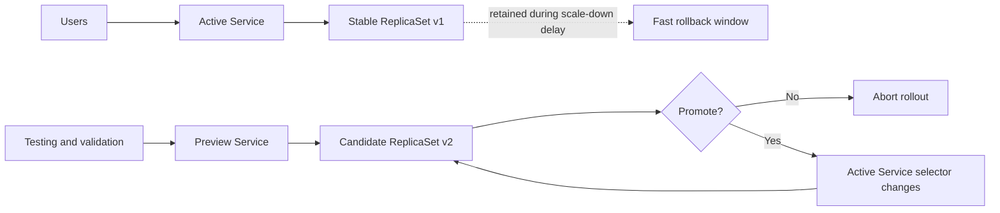
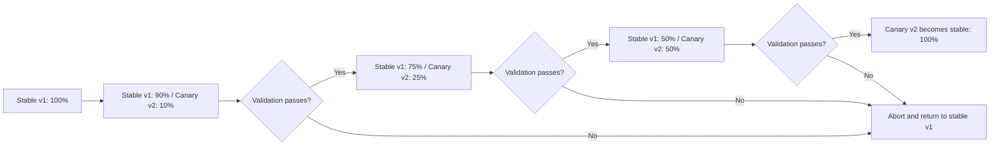
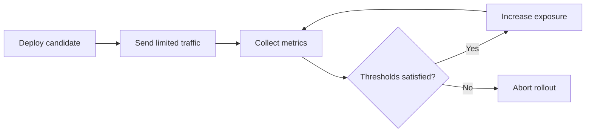

# Argo Rollouts

This document is a conceptual overview of Argo Rollouts for engineers who already understand the basic Kubernetes workload model. It explains what Argo Rollouts adds on top of standard Deployments and why teams use it for controlled production releases.

The focus is Blue/Green deployments, Canary deployments, traffic management, automated analysis, experiments, abort and rollback behaviour, and operational considerations.

This is not an installation guide or a hands-on lab. It does not include manifests, commands, Helm values, or provider-specific configuration.

## Table of Contents

1. [Overview](#1-overview)
2. [The Problem Argo Rollouts Solves](#2-the-problem-argo-rollouts-solves)
3. [Core Components](#3-core-components)
4. [Deployment Strategies](#4-deployment-strategies)
5. [Blue/Green Deployment](#5-bluegreen-deployment)
6. [Canary Deployment](#6-canary-deployment)
7. [Traffic Management](#7-traffic-management)
8. [Rollout Steps and Pauses](#8-rollout-steps-and-pauses)
9. [Analysis and Automated Validation](#9-analysis-and-automated-validation)
10. [Experiments](#10-experiments)
11. [Rollback and Abort Behaviour](#11-rollback-and-abort-behaviour)
12. [Argo Rollouts and Argo CD](#12-argo-rollouts-and-argo-cd)
13. [Operational Considerations](#13-operational-considerations)
14. [Limitations and Common Misconceptions](#14-limitations-and-common-misconceptions)
15. [When to Use Argo Rollouts](#15-when-to-use-argo-rollouts)
16. [Blue/Green Versus Canary](#16-bluegreen-versus-canary)
17. [Summary](#17-summary)
18. [References](#18-references)

## 1. Overview

Argo Rollouts is a Kubernetes controller and a set of custom resources for progressive delivery. It extends Kubernetes with rollout strategies that are more controlled than the standard `Deployment` rolling update.

The main `Rollout` resource is an alternative to a Kubernetes `Deployment`. Like a Deployment, it creates and manages ReplicaSets from a Pod template. Unlike a standard Deployment, it can control how a new ReplicaSet becomes the stable application version through Blue/Green, Canary, pauses, analysis, experiments, and traffic routing.

Progressive delivery means releasing a change gradually and validating it before exposing all users to it. Kubernetes `RollingUpdate` is useful, but it mainly gates progress on pod availability and readiness. For sensitive production releases, that may not be enough. A pod can be ready while the application has functional, latency, error-rate, or business-level problems.

Argo Rollouts reduces this risk by controlling promotion from the old stable ReplicaSet to the new candidate ReplicaSet.

## 2. The Problem Argo Rollouts Solves

A standard Kubernetes rolling update gradually replaces old pods with new pods. Traffic usually continues through the same Kubernetes Service, and Kubernetes primarily evaluates whether pods are created, scheduled, running, and ready.

That is a narrow safety check. A new pod can pass readiness while returning incorrect responses, increasing latency, failing only on a subset of requests, or breaking a business workflow. Standard rolling updates also provide limited native support for staged traffic exposure, manual approval, metric-based promotion, or automated rollback based on external signals.

Progressive delivery reduces the blast radius. A new version can receive preview traffic, a small percentage of production traffic, or no production traffic until validation succeeds. Promotion can pause for human review or depend on metrics such as error rate, latency, availability, restart count, or successful transaction rate.

## 3. Core Components

Argo Rollouts uses a small set of required resources and several optional resources. The required pieces replace the Deployment rollout controller for a workload. The optional pieces add validation, traffic routing, or GitOps integration.

Required components:

* **Argo Rollouts controller** watches Rollout-related resources and reconciles ReplicaSets, Services, analysis, experiments, and traffic provider configuration.
* **`Rollout`** declares the workload and rollout strategy. It is the primary application resource managed by Argo Rollouts.
* **Stable ReplicaSet** is the current production version.
* **New or candidate ReplicaSet** is the version being introduced and validated.

Strategy-dependent components:

* **Active Service** is used by Blue/Green rollouts to send production traffic to the active version.
* **Preview Service** is optionally used by Blue/Green rollouts to expose the candidate version before promotion.
* **Stable Service** is used by traffic-routed Canary rollouts to identify the stable version for the traffic provider.
* **Canary Service** is used by traffic-routed Canary rollouts to identify the candidate version for the traffic provider.
* **Ingress controller or service mesh** is required when a rollout needs explicit request-level traffic weights instead of replica-based approximation.

Optional validation components:

* **`AnalysisTemplate`** defines how to measure rollout health, including metric queries, success conditions, and failure conditions.
* **`AnalysisRun`** is an execution of an `AnalysisTemplate` during a rollout.
* **`Experiment`** creates temporary ReplicaSets, often for baseline-versus-candidate comparison or controlled validation before promotion.

Related but separate component:

* **Argo CD** reconciles Kubernetes resources from Git. It may apply a `Rollout` definition and display rollout health, but Argo Rollouts controls runtime promotion, pauses, traffic movement, analysis, and abort behavior.

Metric analysis, experiments, Argo CD, and service-mesh integration are optional capabilities. Services used for Blue/Green and traffic-routed Canary strategies are part of those rollout designs.

## 4. Deployment Strategies

Kubernetes and Argo Rollouts support several ways to move from one application version to another. The right strategy depends on how much control is needed, how much extra capacity is available, and whether the team can validate a release with useful signals.

### Kubernetes RollingUpdate

Kubernetes RollingUpdate gradually replaces pods. The existing Kubernetes Service distributes traffic across ready pods that match its selector. There is normally no explicit stable-versus-candidate traffic policy, no built-in metric analysis, and no separate promotion event.

This is simple and suitable for many low-risk applications.

### Blue/Green

Blue/Green keeps two application versions available at the same time. One version is active and receives production traffic. The other version is available for preview and validation. Promotion changes which version receives production traffic.

### Canary

Canary introduces a new version gradually. A small part of capacity or traffic uses the candidate version first. Exposure then increases through rollout steps until the candidate becomes stable.

| Area | RollingUpdate | Blue/Green | Canary |
|---|---|---|---|
| Traffic movement | Service sends traffic to ready pods | Production Service switches from one version to another | Traffic or pod share changes step by step |
| Running versions | Usually overlaps during replacement | Two complete versions during validation | Stable and candidate during rollout |
| Promotion model | Implicit | Explicit cutover | Gradual promotion |
| Rollback behavior | Return to an older revision | Switch back while old version is retained | Abort and return traffic or capacity to stable |
| Requirements | Kubernetes Deployment and Service | Additional Services and capacity | Steps; optional traffic provider and metrics |
| Best fit | Low-risk changes | Clear cutover and preview validation | Gradual exposure with useful live signals |

## 5. Blue/Green Deployment

Blue/Green is useful when a team wants to validate a complete candidate version before sending production traffic to it. The key operation is promotion: the production Service changes from selecting the stable ReplicaSet to selecting the candidate ReplicaSet.

Conceptual lifecycle:

1. The stable version serves production traffic.
2. A new ReplicaSet is created.
3. The preview Service points to the new version.
4. The active Service continues pointing to the stable version.
5. The new version is validated.
6. Promotion switches production traffic to the new version.
7. The previous version is retained temporarily.
8. The previous version is eventually scaled down.
9. If validation fails, promotion is stopped or the rollout is aborted.



Before promotion, the Active Service selects the stable ReplicaSet and the Preview Service selects the candidate ReplicaSet. After promotion, the same Active Service selects the candidate ReplicaSet. Promotion changes Service selection inside Kubernetes rather than moving workloads between clusters.

The scale-down delay keeps the previous ReplicaSet available for a short period after promotion. That creates a rollback window where traffic can switch back quickly. Teams should still test rollback behavior because controller reconciliation, load balancer updates, application startup, and external dependencies can affect timing.

Promotion can be manual or automatic. Manual promotion waits for an operator decision. Automatic promotion continues after configured conditions, such as a delay or successful analysis.

> **Production note:** Blue/Green does not automatically guarantee zero downtime. Cutover behaviour depends on the Service, ingress controller, cloud load balancer, readiness checks, and connection handling.

> **AWS ALB note:** AWS ALB behaviour is provider-specific. Switching Kubernetes Service selectors can temporarily leave an ALB target group without healthy targets, so Blue/Green with AWS ALB should be validated before it is described as zero-downtime. Traffic-routed Canary through the ALB integration is a different pattern from basic Blue/Green Service selector switching.

## 6. Canary Deployment

Canary is useful when a team wants to reduce risk by exposing a new version gradually. The candidate receives limited traffic or capacity first, then progresses only when validation passes.

Conceptual lifecycle:

1. The stable version initially receives all traffic.
2. A candidate ReplicaSet is created.
3. A small percentage of users or requests reaches the candidate.
4. The rollout pauses or evaluates metrics.
5. Candidate exposure increases gradually.
6. The process repeats until the new version receives all traffic.
7. The candidate becomes stable.
8. The previous version is scaled down.
9. Failed validation aborts the rollout.



> **Traffic note:** These percentages represent explicit request weights when a supported traffic-routing provider is configured. Without traffic routing, Argo Rollouts approximates the requested weight through stable and Canary replica counts.

The percentages are examples. Argo Rollouts does not require those exact values.

## 7. Traffic Management

Traffic management determines whether rollout weights are approximate pod ratios or explicit request-routing rules. This distinction matters because a "10% canary" can mean different things depending on whether a traffic provider is involved.

### Replica-Based Canary

In a replica-based Canary, Argo Rollouts approximates traffic percentages using the number of stable and canary pods. Kubernetes Services then distribute requests across the selected ready pods.

For example, nine stable pods and one canary pod approximate a 10% canary. That does not guarantee exactly 10% of requests reach the canary. Small replica counts make percentages coarse, and long-lived connections, uneven request rates, client behavior, and session affinity can skew distribution.

> **Production note:** Without traffic routing, Canary weights are approximations. Use this model only when the application can tolerate uneven request distribution.

### Traffic-Routed Canary

Traffic-routed Canary integrates Argo Rollouts with a supported ingress controller or service mesh. The routing provider receives explicit traffic-weight changes, while ReplicaSet scaling can be managed separately.

This gives more accurate request distribution than replica-based Canary. It also supports patterns that pod ratios cannot express well, such as keeping the stable ReplicaSet fully scaled while sending only a small request percentage to the candidate.

Common integration categories include:

* NGINX Ingress.
* AWS Application Load Balancer.
* Istio.
* Gateway API, Kong, Traefik, Apache APISIX, Google Cloud, Service Mesh Interface, and other supported providers.

Supported features, limitations, and behavior differ by provider. Provider-specific routing semantics should be checked before relying on exact behavior.

## 8. Rollout Steps and Pauses

Rollout steps define how a candidate version progresses from first exposure to full promotion. They are useful when each step has a clear validation signal or approval point.

A step can set a new traffic or replica weight, pause for a fixed duration, pause until manual promotion, run analysis, start an experiment, continue to the next exposure level, or abort when validation fails.

A **timed pause** waits for a fixed duration before continuing. An **indefinite pause** waits until an operator or automation resumes the rollout. **Manual promotion** advances a paused rollout by explicit decision. **Automatic promotion** advances when configured conditions pass. **Full promotion** completes the rollout so the candidate becomes the stable version.

Pauses are useful only when the team knows what signal should be checked during the pause. Waiting longer without meaningful validation does not make a rollout safer.

## 9. Analysis and Automated Validation

Analysis connects rollout progression to external signals. It lets a rollout continue, stop, or wait based on measurements rather than only pod readiness.

An `AnalysisTemplate` defines a validation check. It can describe which external metric provider to query, how often to query it, and which success or failure conditions decide the result.

An `AnalysisRun` is a concrete execution of that template. A `Successful` AnalysisRun allows the rollout to continue. A `Failed` AnalysisRun normally causes the rollout to abort. An `Inconclusive` AnalysisRun pauses the rollout and requires operator action. Measurement errors, consecutive error limits, failure limits, and inconclusive limits can affect the final AnalysisRun phase.

Useful metrics may include:

* HTTP error rate.
* Request latency.
* Availability.
* Pod restart count.
* Application-specific business metrics.
* Successful transaction rate.

General flow:

1. Deploy a candidate version.
2. Send limited traffic to it.
3. Collect metrics.
4. Compare metrics with defined thresholds.
5. Increase exposure when validation succeeds.
6. Abort when validation fails.



> **Production note:** Metric quality is critical. Weak queries, missing labels, delayed data, noisy thresholds, or metrics that do not represent user impact can promote a broken version or reject a healthy one.

## 10. Experiments

Experiments are temporary validation resources used during rollout evaluation. They are useful when a team needs to compare versions before promotion rather than only observe the candidate under normal rollout traffic.

Argo Rollouts Experiments run temporary ReplicaSets and optional analysis during rollout validation. They can run multiple versions simultaneously, compare a baseline and candidate version, execute analysis against both, and support controlled tests before promotion.

An Experiment is not the same thing as a long-running production Deployment. It is a temporary validation resource, and its ReplicaSets are normally cleaned up after the experiment completes or terminates.

## 11. Rollback and Abort Behaviour

Rollback and abort are often discussed together, but they are not the same operation. Argo Rollouts can stop runtime progression and redirect traffic, while reverting the declared application version is a separate desired-state change.

* **Pause** stops progression at the current point.
* **Abort** stops the current rollout attempt and returns traffic to the stable version when supported by the selected strategy.
* **Promotion** advances the candidate toward becoming the stable version.
* **Runtime traffic return** sends production traffic or capacity back to the stable ReplicaSet without necessarily changing Git.
* **Rollback by specification** means restoring an older declarative Rollout revision, usually directly or through GitOps.

Aborting stops the current rollout and returns traffic to the stable version when supported by the selected strategy. Restoring an older declarative revision is a separate change to the Rollout specification, usually performed directly or through GitOps.

Resources may not disappear immediately because scale-down delays and controller reconciliation still apply. Rollback behavior differs between Blue/Green and Canary. Blue/Green can switch the active Service back while the old ReplicaSet is retained. Canary can return traffic or capacity to the stable ReplicaSet, especially when traffic routing leaves stable capacity available.

Operational teams should test abort and rollback paths instead of assuming they are instantaneous.

## 12. Argo Rollouts and Argo CD

Argo CD and Argo Rollouts solve different problems. They are commonly used together, but one does not replace the other.

### Argo CD

Argo CD reconciles Kubernetes resources from Git. It ensures the cluster matches the declared desired state and detects configuration drift.

### Argo Rollouts

Argo Rollouts controls runtime progression between application versions. It manages stable and candidate ReplicaSets and coordinates promotion, pauses, analysis, traffic changes, experiments, and aborts.

Normal flow:

```text
Git change
    ↓
Argo CD applies the desired Rollout definition
    ↓
Argo Rollouts creates and manages the new ReplicaSet
    ↓
Traffic and validation steps progress
    ↓
The new version becomes stable or the rollout is aborted
```

Argo CD may display a Rollout as progressing or suspended while Argo Rollouts waits at a pause or analysis step. Argo CD does not itself perform Canary traffic management.

## 13. Operational Considerations

Progressive delivery changes the release process, but it does not remove normal production engineering work. The application, cluster, traffic layer, metrics, and operational process all need to support two versions running at the same time.

Argo Rollouts adds CRDs and a controller that must be installed, upgraded, monitored, and authorized. It can create extra ReplicaSets and temporary workloads, so clusters need enough capacity to run stable and candidate versions at the same time.

> **Production note:** Plan capacity for overlap. Blue/Green and traffic-routed Canary can temporarily require enough resources for both stable and candidate versions.

Autoscaling requires care. The HPA sets the desired replica count on the Rollout scale subresource, while the Argo Rollouts controller allocates pods across ReplicaSets according to the strategy. PodDisruptionBudgets, readiness probes, liveness probes, and startup probes still matter because they affect availability and endpoint selection.

Application design must support two versions running at the same time. Backward-compatible APIs, events, queues, background workers, session handling, and long-lived connections all need review. Stateful workloads are harder because traffic movement and ReplicaSet scaling do not automatically solve data compatibility.

> **Production note:** Database migrations must remain compatible with both versions during a rollout. Destructive migrations can break the stable version while it is still serving traffic. Expand-and-contract migration patterns are safer for progressive delivery.

Operational teams should also consider:

* Promotion permissions and RBAC.
* Metric reliability and alert quality.
* Ingress-controller-specific behavior.
* Rollback testing.
* Version pinning and controller upgrades.
* Behavior during consecutive application updates.

## 14. Limitations and Common Misconceptions

Argo Rollouts gives teams more deployment control, but it does not make unsafe application changes safe by itself. These limitations are common sources of incorrect expectations.

* A healthy pod does not necessarily mean a healthy application.
* Canary percentages are not always exact without traffic routing.
* Argo Rollouts does not automatically define meaningful application metrics.
* Argo Rollouts does not replace an ingress controller or service mesh.
* Argo Rollouts does not replace Argo CD.
* Blue/Green does not automatically guarantee zero downtime.
* Rollback cannot undo incompatible database changes.
* More rollout stages do not automatically make a deployment safer.
* Progressive delivery still requires monitoring, capacity planning, and operational ownership.

## 15. When to Use Argo Rollouts

Use Argo Rollouts when the release risk justifies the extra controller, resources, and operating model. A standard Deployment is still the simpler choice when readiness checks and RollingUpdate already provide acceptable risk.

Argo Rollouts is useful for:

* High-impact production applications.
* Services where a failed deployment can affect many users.
* Applications with reliable operational or business metrics.
* Environments requiring approval before promotion.
* Systems using service meshes or advanced ingress routing.
* Teams already using GitOps.
* Applications where fast rollback is important.
* Releases that benefit from gradual exposure.

A standard Deployment may be enough for:

* Internal or low-risk applications.
* Small development environments.
* Applications without useful validation metrics.
* Services where running two versions simultaneously is impossible.
* Teams without capacity to maintain additional controllers and rollout logic.
* Deployments where readiness checks and RollingUpdate already provide acceptable risk.

Argo Rollouts should solve a real release problem, not be added only because progressive delivery sounds safer.

## 16. Blue/Green Versus Canary

Blue/Green and Canary both reduce deployment risk, but they optimize for different operating models. Blue/Green gives a clear cutover between complete versions. Canary gives gradual exposure and finer control, but it depends more heavily on traffic distribution and metric quality.

Blue/Green is generally appropriate when a complete candidate environment must be validated before cutover, fast switching between complete versions is valuable, additional temporary capacity is acceptable, and a clear promotion event is desired.

Canary is generally appropriate when risk should be reduced through gradual user exposure, the application can be validated using live production traffic, traffic weighting or sufficient replica counts are available, and the team has reliable monitoring and automated analysis.

Neither strategy is universally better.

## 17. Summary

Argo Rollouts adds progressive delivery controls to Kubernetes through a Rollout resource and controller. It manages stable and candidate ReplicaSets through strategies such as Blue/Green and Canary.

Blue/Green validates a complete candidate version before switching production traffic. Canary exposes the candidate gradually. Replica-based Canary approximates request share through pod counts, while traffic-routed Canary uses an ingress controller or service mesh for explicit request weights.

Automated analysis can promote or stop a rollout based on metrics. Argo CD can apply and observe Rollout resources from Git, but Argo Rollouts performs the runtime rollout control.

The main trade-off is more deployment control in exchange for additional controller, capacity, routing, metrics, and operational complexity.

## 18. References

* [Argo Rollouts documentation](https://argoproj.github.io/argo-rollouts/)
* [Argo Rollouts concepts](https://argoproj.github.io/argo-rollouts/concepts/)
* [BlueGreen deployment strategy](https://argoproj.github.io/argo-rollouts/features/bluegreen/)
* [Canary deployment strategy](https://argoproj.github.io/argo-rollouts/features/canary/)
* [Traffic management](https://argoproj.github.io/argo-rollouts/features/traffic-management/)
* [Analysis and progressive delivery](https://argoproj.github.io/argo-rollouts/features/analysis/)
* [Experiments](https://argoproj.github.io/argo-rollouts/features/experiment/)
* [Argo CD integration FAQ](https://argoproj.github.io/argo-rollouts/FAQ/)
* [Rollout specification](https://argoproj.github.io/argo-rollouts/features/specification/)
