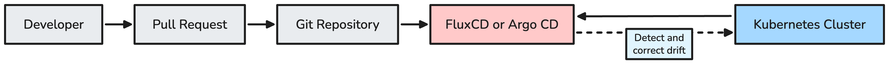

# FluxCD and Argo CD GitOps Basics

This document explains what FluxCD and Argo CD are, why teams use them, and how to deploy a simple demo application with each tool.

The examples are intentionally small. They are for learning, local clusters, and basic platform discussions. They are not a production GitOps platform design.

## Table of Contents

- [1. What GitOps Means](#1-what-gitops-means)
- [2. Why Use FluxCD or Argo CD](#2-why-use-fluxcd-or-argo-cd)
- [3. FluxCD and Argo CD at a Glance](#3-fluxcd-and-argo-cd-at-a-glance)
- [4. Basic Repository Layout](#4-basic-repository-layout)
- [5. Demo Application Manifests](#5-demo-application-manifests)
- [6. Deploying the Demo App with FluxCD](#6-deploying-the-demo-app-with-fluxcd)
- [7. Deploying the Demo App with Argo CD](#7-deploying-the-demo-app-with-argo-cd)
- [8. Helm Examples](#8-helm-examples)
- [9. Day-to-Day Usage](#9-day-to-day-usage)
- [10. Drift Correction](#10-drift-correction)
- [11. Common Troubleshooting Commands](#11-common-troubleshooting-commands)
- [12. When to Use Which](#12-when-to-use-which)
- [13. Practical Recommendations](#13-practical-recommendations)
- [14. References](#14-references)

## 1. What GitOps Means

GitOps means the desired state of the system is stored in Git. A controller running inside Kubernetes watches Git and makes the cluster match what is declared there.

Basic flow:



This is a pull-based model. The controller runs in the cluster, reads Git, and applies the desired state.

CI builds, tests, scans, and publishes an artifact. GitOps deploys the desired state stored in Git.

```text
Developer push
    |
    v
CI pipeline
- test
- build
- scan
- push image
    |
    v
Update image tag in GitOps repository
    |
    v
FluxCD or Argo CD reconciles the cluster
```

Git becomes the operational source of truth:

- What should run
- Which namespace it should run in
- Which image version should be deployed
- Which Helm chart or Kustomize overlay should be applied
- Who changed the desired state and when

## 2. Why Use FluxCD or Argo CD

Without GitOps, many teams deploy directly from CI pipelines using broad cluster credentials. That works for small setups, but it becomes harder to audit and recover.

GitOps helps because:

- Changes are reviewed through pull requests.
- The desired cluster state is visible in Git.
- Clusters continuously reconcile to the declared state.
- Drift can be detected and corrected.
- CI does not need long-lived admin access to every cluster.
- Previous Kubernetes configuration is visible in Git.

GitOps does not replace CI. CI still builds, tests, scans, and publishes artifacts. GitOps handles the deployment reconciliation.

```text
CI:
Build image -> Test -> Push image

GitOps:
Watch Git -> Apply manifests -> Keep cluster in sync
```

## 3. FluxCD and Argo CD at a Glance

| Area | FluxCD | Argo CD |
|---|---|---|
| Main model | Modular Kubernetes controllers | Application-centric GitOps |
| Primary resource | `Kustomization`, `HelmRelease` | `Application` |
| User interface | CLI and ecosystem UIs | Strong built-in web UI |
| Configuration style | Multiple specialized CRDs | Central `Application` resource |
| Helm support | `HelmRelease` controller | Native Helm source support |
| Best fit | Kubernetes-native and automation-heavy workflows | Teams wanting application visualization and centralized UI |

Both tools use a pull-based model, continuously reconcile desired and actual state, support Helm and Kustomize, detect configuration drift, can automatically prune removed resources, and can manage multiple clusters.

High-level difference:

```text
FluxCD:
`GitRepository` + Flux `Kustomization` custom resource / `HelmRelease` -> applied by controllers

Argo CD:
`Application` -> points to repo/path/chart -> applied by Argo CD
```

The final choice depends on team workflow and operational preferences. Neither tool is universally better.

## 4. Basic Repository Layout

Start with a simple layout. Do not create a large hierarchy before there are real environments and teams.

```text
gitops-repo/
├── apps/
│   └── dummy-app/
│       ├── namespace.yaml
│       ├── deployment.yaml
│       ├── service.yaml
│       └── kustomization.yaml
│
└── clusters/
    └── local/
        ├── flux/
        │   └── dummy-app.yaml
        └── argocd/
            └── dummy-app.yaml
```

Meaning:

- `apps/dummy-app` contains the application manifests.
- `clusters/local/flux` contains Flux reconciliation resources.
- `clusters/local/argocd` contains Argo CD `Application` resources.
- More clusters can be added later as `clusters/dev`, `clusters/staging`, or `clusters/prod`.

> **Important:** The FluxCD and Argo CD examples are alternative ways to deploy the same application. Do not configure both controllers to reconcile the same Kubernetes resources.

For a demo, one repository is enough. For production, teams often separate application source code from deployment configuration.

## 5. Demo Application Manifests

Create a small app under `apps/dummy-app`.

`apps/dummy-app/namespace.yaml`:

```yaml
apiVersion: v1
kind: Namespace
metadata:
  name: dummy-app
```

`apps/dummy-app/deployment.yaml`:

```yaml
apiVersion: apps/v1
kind: Deployment
metadata:
  name: dummy-app
  namespace: dummy-app
spec:
  replicas: 1
  selector:
    matchLabels:
      app: dummy-app
  template:
    metadata:
      labels:
        app: dummy-app
    spec:
      containers:
        - name: nginx
          image: nginx:1.27-alpine
          ports:
            - containerPort: 80
```

`apps/dummy-app/service.yaml`:

```yaml
apiVersion: v1
kind: Service
metadata:
  name: dummy-app
  namespace: dummy-app
spec:
  selector:
    app: dummy-app
  ports:
    - port: 80
      targetPort: 80
```

`apps/dummy-app/kustomization.yaml`:

```yaml
apiVersion: kustomize.config.k8s.io/v1beta1
kind: Kustomization
resources:
  - namespace.yaml
  - deployment.yaml
  - service.yaml
```

Validate before committing:

```bash
kubectl kustomize apps/dummy-app
```

Commit and push these files before pointing FluxCD or Argo CD at the path.

Both Argo CD and Kubernetes can create namespaces in other ways, but this example keeps the namespace definition in Git together with the application manifests.

## 6. Deploying the Demo App with FluxCD

FluxCD is commonly bootstrapped with the `flux` CLI. Bootstrap installs the Flux controllers and configures them to watch a repository path.

Example bootstrap:

```bash
export GITHUB_TOKEN=<token>
export GITHUB_USER=<github-user>

flux check --pre

flux bootstrap github \
  --owner="$GITHUB_USER" \
  --repository=gitops-repo \
  --branch=main \
  --path=./clusters/local/flux \
  --personal
```

Flux processes resources under its configured reconciliation path. An Argo CD `Application` resource should not be located under the Flux-managed path. Without the Argo CD CRD, Flux reconciliation could fail. With Argo CD installed, both controllers could accidentally manage the same application.

After bootstrap, Flux creates a `GitRepository` named `flux-system` in the `flux-system` namespace. Add a Flux `Kustomization` custom resource that points to the app path.

> **Note:** A Flux `Kustomization` custom resource is not the same as a standard Kustomize `kustomization.yaml` file. The Flux resource tells the controller which Git path to reconcile, while `kustomization.yaml` defines how Kubernetes manifests are assembled.

`clusters/local/flux/dummy-app.yaml`:

```yaml
apiVersion: kustomize.toolkit.fluxcd.io/v1
kind: Kustomization
metadata:
  name: dummy-app
  namespace: flux-system
spec:
  interval: 5m
  path: ./apps/dummy-app
  prune: true
  wait: true
  sourceRef:
    kind: GitRepository
    name: flux-system
```

Commit it under the bootstrap path so Flux applies it:

```bash
git add apps/dummy-app clusters/local/flux/dummy-app.yaml
git commit -m "Deploy dummy app with Flux"
git push
```

`prune: true` removes Kubernetes resources that disappear from Git. `wait: true` tells Flux to wait for applied resources to become ready before marking the reconciliation successful.

Check status:

```bash
flux get sources git -A
flux get kustomizations -A
kubectl -n dummy-app get deploy,svc,pods
```

Force a reconciliation during testing:

```bash
flux reconcile kustomization dummy-app --with-source
```

For a private repository, configure deploy keys or a Git secret instead of embedding credentials in manifests.

## 7. Deploying the Demo App with Argo CD

Argo CD is usually installed into the `argocd` namespace. The official quick-start install is enough for a local demo.

Install Argo CD:

```bash
kubectl create namespace argocd
kubectl apply -n argocd -f https://raw.githubusercontent.com/argoproj/argo-cd/stable/manifests/install.yaml
kubectl -n argocd rollout status deployment/argocd-server
```

For local access to the UI:

```bash
kubectl -n argocd port-forward svc/argocd-server 8080:443
```

Argo CD deploys applications using an `Application` object.

Use a neutral placeholder repository URL such as `https://github.com/example/gitops-repo.git` and replace it with your own GitOps repository.

`clusters/local/argocd/dummy-app.yaml`:

```yaml
apiVersion: argoproj.io/v1alpha1
kind: Application
metadata:
  name: dummy-app
  namespace: argocd
spec:
  project: default

  source:
    repoURL: https://github.com/example/gitops-repo.git
    targetRevision: main
    path: apps/dummy-app

  destination:
    server: https://kubernetes.default.svc
    namespace: dummy-app

  syncPolicy:
    automated:
      prune: true
      selfHeal: true
```

Apply the application:

```bash
kubectl apply -f clusters/local/argocd/dummy-app.yaml
```

`prune: true` lets Argo CD remove resources that are no longer defined in Git. `selfHeal: true` lets automated sync correct live-cluster drift back to the Git state.

Check status:

```bash
kubectl -n argocd get applications
kubectl -n argocd describe application dummy-app
kubectl -n dummy-app get deploy,svc,pods
```

If using the Argo CD CLI:

```bash
argocd app get dummy-app
argocd app sync dummy-app
argocd app logs dummy-app
```

The UI shows sync status, health status, Kubernetes resources, events, and diffs between Git and the cluster.

## 8. Helm Examples

Both tools can deploy Helm charts. Keep the first demo simple with Kustomize, then add Helm when the team understands the reconciliation model.

FluxCD Helm flow:

```text
HelmRepository -> HelmRelease -> helm-controller -> Kubernetes
```

Minimal FluxCD Helm example:

```yaml
apiVersion: source.toolkit.fluxcd.io/v1
kind: HelmRepository
metadata:
  name: podinfo
  namespace: flux-system
spec:
  interval: 1h
  url: https://stefanprodan.github.io/podinfo
---
apiVersion: helm.toolkit.fluxcd.io/v2
kind: HelmRelease
metadata:
  name: podinfo
  namespace: default
spec:
  interval: 10m
  chart:
    spec:
      chart: podinfo
      version: "6.x"
      sourceRef:
        kind: HelmRepository
        name: podinfo
        namespace: flux-system
  values:
    replicaCount: 2
```

Argo CD can use a Helm repository directly in an `Application` source:

```yaml
source:
  repoURL: https://stefanprodan.github.io/podinfo
  chart: podinfo
  targetRevision: "6.x"
  helm:
    values: |
      replicaCount: 2
```

Argo CD renders the chart and applies the resulting Kubernetes resources.

## 9. Day-to-Day Usage

Normal change flow:

1. Update Kubernetes YAML, Kustomize, or Helm values in Git.
2. Open a pull request.
3. Review and merge.
4. FluxCD or Argo CD detects the change.
5. The cluster reconciles to the new desired state.
6. Verify pod health, service behavior, logs, and metrics.

Common examples:

| Change | Git change |
| --- | --- |
| Deploy a new image | Update `image:` tag or Helm values |
| Scale a demo app | Change `replicas` |
| Add a service | Add a `Service` manifest |
| Add config | Add a `ConfigMap` or external secret reference |
| Restore previous manifests | Revert or reapply an earlier Git change |

Do not store secrets directly in Git. Use a secret management pattern such as External Secrets, SOPS, Sealed Secrets, or a cloud secret manager integration.

A Git revert can restore a previous desired Kubernetes configuration. However, application state, database migrations, and other stateful changes may require a separate rollback or recovery procedure.

GitOps provides configuration history, reviewable changes, reproducible desired state, and a simple way to restore previous manifests. It does not automatically make every application or database change reversible.

## 10. Drift Correction

Drift means the live cluster no longer matches Git.

Example:

1. Git defines `replicas: 3`.
2. Someone manually changes the Deployment to `replicas: 1`.
3. The GitOps controller detects that the cluster differs from Git.
4. The controller restores `replicas: 3`.

Flux calls this reconciliation. Argo CD reports the application as `OutOfSync` and can self-heal when automated self-healing is enabled.

## 11. Common Troubleshooting Commands

FluxCD:

```bash
flux get all -A
flux get sources git -A
flux get kustomizations -A
flux get helmreleases -A
flux reconcile kustomization dummy-app --with-source
flux logs --follow
kubectl describe kustomization dummy-app -n flux-system
kubectl logs -n flux-system deployment/kustomize-controller
```

Argo CD:

```bash
argocd app list
argocd app get dummy-app
argocd app diff dummy-app
argocd app sync dummy-app
argocd app history dummy-app
kubectl describe application dummy-app -n argocd
kubectl logs -n argocd deployment/argocd-application-controller
```

Application:

```bash
kubectl -n dummy-app get deploy,svc,pods
kubectl -n dummy-app describe pod <pod-name>
kubectl -n dummy-app logs deploy/dummy-app
kubectl get events -A --sort-by=.metadata.creationTimestamp
```

Useful checks:

- Can the controller reach the Git repository?
- Is the path correct?
- Is the branch correct?
- Does `kubectl kustomize <path>` render locally?
- Does the image exist and support the cluster CPU architecture?
- Are namespace, RBAC, and admission policies blocking the deployment?

## 12. When to Use Which

FluxCD may fit better when:

- the team prefers Kubernetes-native workflows;
- automation and composable controllers are important;
- Helm releases are managed through CRDs;
- CLI and Git workflows are preferred over a central UI.

Argo CD may fit better when:

- the team wants a strong built-in web UI;
- application visualization is important;
- operators want an easy view of sync and health status;
- centralized multi-application management is preferred.

Both tools solve the same core problem. The better choice depends on the team's operating model, not on a universal technical winner.

## 13. Practical Recommendations

- Start with one demo app and one cluster path.
- Keep app manifests small and readable.
- Prefer pull requests over direct pushes to deployment branches.
- Keep CI responsible for building images and GitOps responsible for deployment.
- Use private repo access through deploy keys, GitHub Apps, or scoped tokens.
- Do not give CI broad Kubernetes admin credentials unless there is a clear reason.
- Do not enable auto-prune on important environments until the team understands the blast radius.
- Use Argo CD UI or Flux status commands during onboarding so people can see reconciliation.
- Add production patterns later: SSO, RBAC, notifications, progressive delivery, image automation, policy checks, and secret management.

## 14. References

- [FluxCD Concepts](https://fluxcd.io/flux/concepts/)
- [FluxCD Get Started](https://fluxcd.io/flux/get-started/)
- [FluxCD Bootstrap for GitHub](https://fluxcd.io/flux/installation/bootstrap/github/)
- [FluxCD GitRepository](https://fluxcd.io/flux/components/source/gitrepositories/)
- [FluxCD Kustomization](https://fluxcd.io/flux/components/kustomize/kustomizations/)
- [FluxCD HelmRelease](https://fluxcd.io/flux/components/helm/helmreleases/)
- [Argo CD Core Concepts](https://argo-cd.readthedocs.io/en/stable/core_concepts/)
- [Argo CD Getting Started](https://argo-cd.readthedocs.io/en/stable/getting_started/)
- [Argo CD Application Specification](https://argo-cd.readthedocs.io/en/stable/user-guide/application-specification/)
- [Argo CD Automated Sync](https://argo-cd.readthedocs.io/en/stable/user-guide/auto_sync/)
- [Argo CD Helm](https://argo-cd.readthedocs.io/en/stable/user-guide/helm/)
- [Kustomize kustomization.yaml](https://kubectl.docs.kubernetes.io/references/kustomize/kustomization/)
