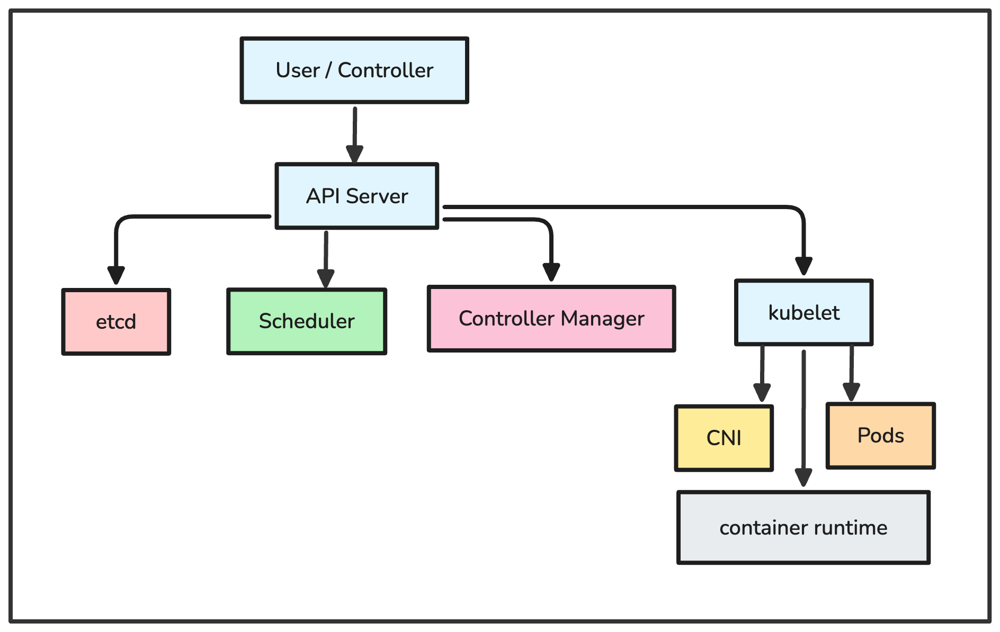
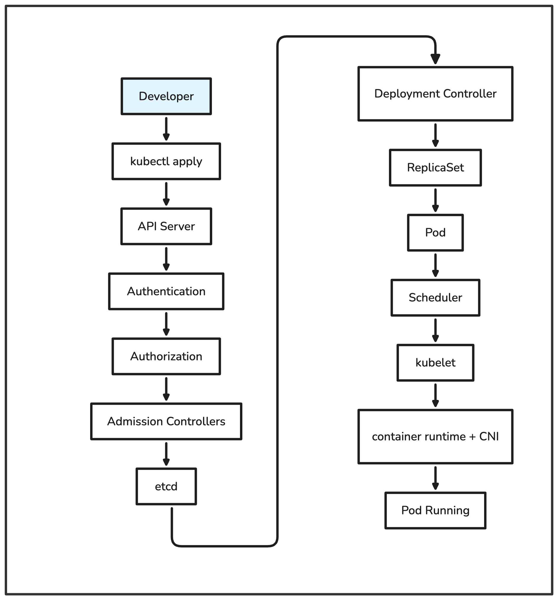
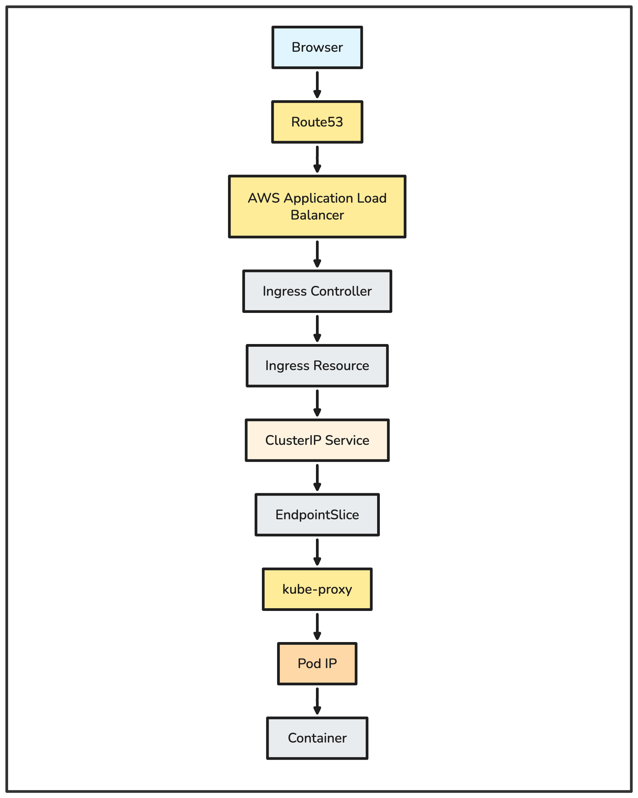
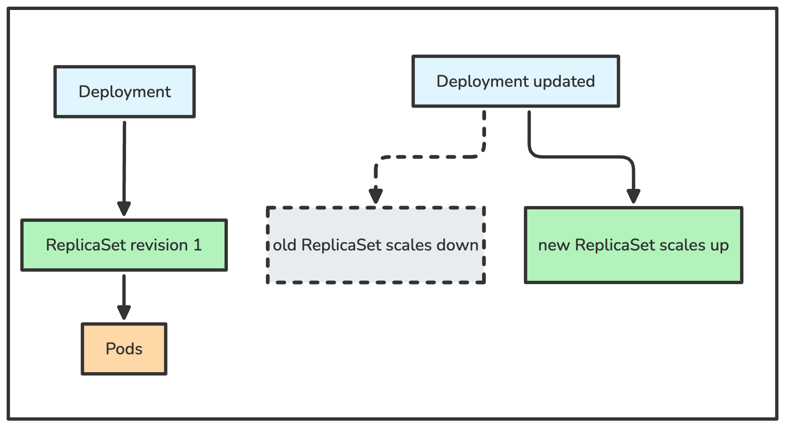
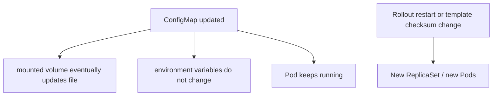
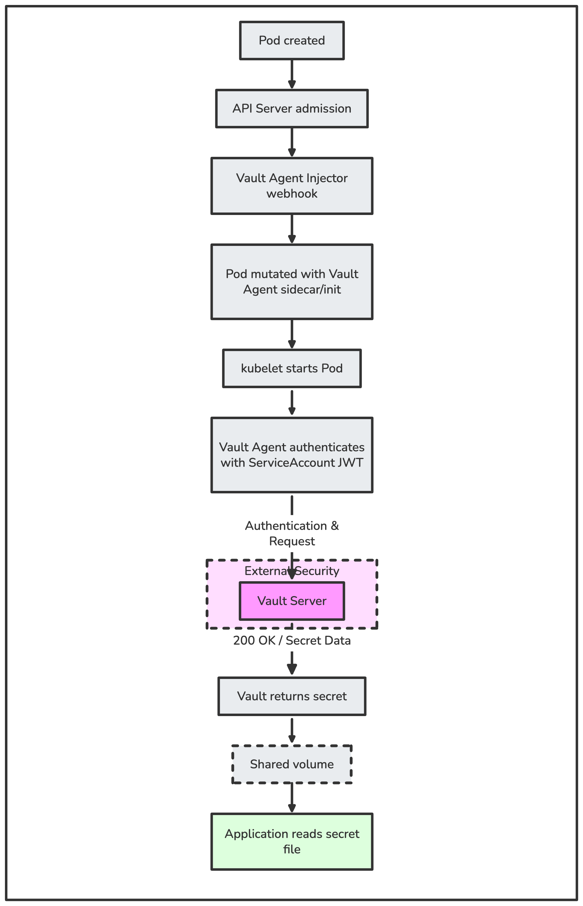
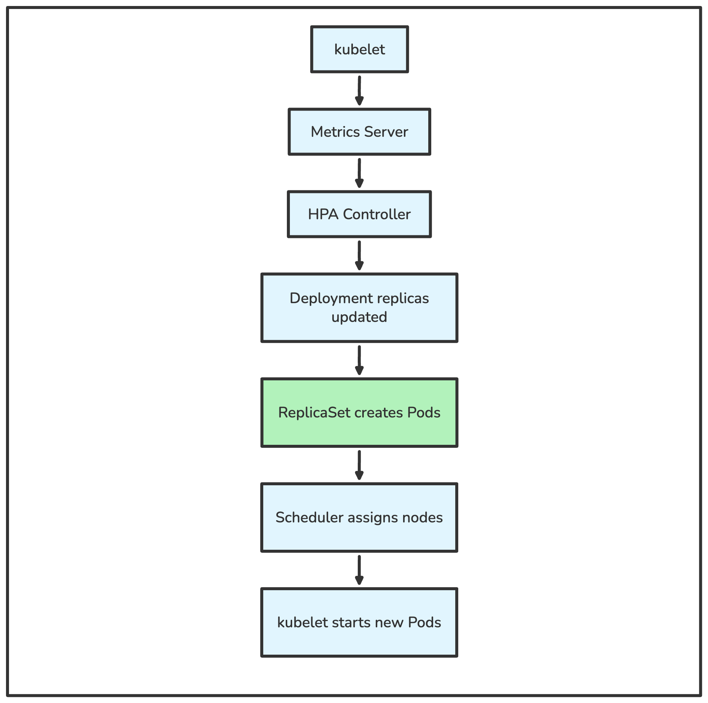
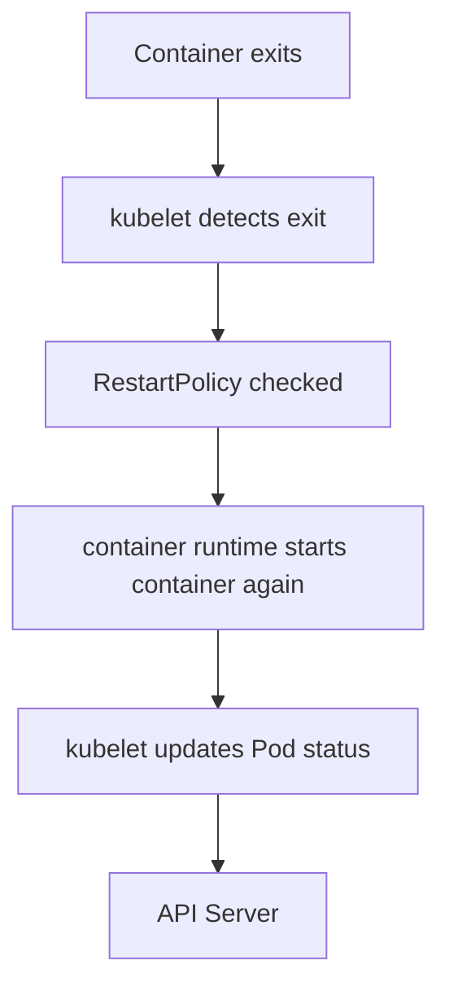
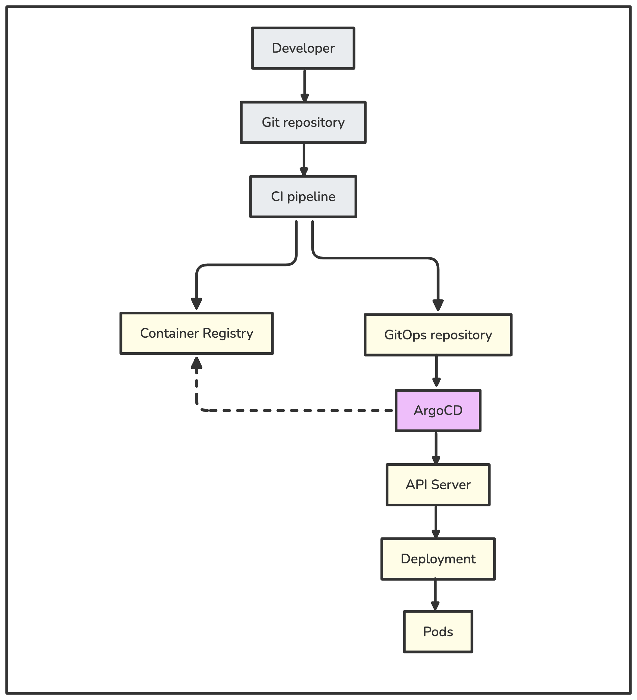

# Kubernetes Internals

This document explains what happens inside Kubernetes during common day-to-day operations. It is for engineers who already work with Kubernetes objects and want to understand the workflows behind them.

It is not a Kubernetes course, an interview guide, or a replacement for official component documentation. The focus is practical: what talks to what, where state is stored, which component makes a decision, and what usually matters in production.

## Table of Contents

* [1. Introduction](#1-introduction)
* [2. Kubernetes Architecture](#2-kubernetes-architecture)
* [3. kubectl apply to Pod Running](#3-kubectl-apply-to-pod-running)
* [4. Browser to ALB to Ingress to Service to Pod](#4-browser-to-alb-to-ingress-to-service-to-pod)
* [5. Deployment to ReplicaSet to Pod](#5-deployment-to-replicaset-to-pod)
* [6. ConfigMap Update to Rollout](#6-configmap-update-to-rollout)
* [7. Secret to Vault to Pod](#7-secret-to-vault-to-pod)
* [8. HPA to Metrics Server to Scheduler](#8-hpa-to-metrics-server-to-scheduler)
* [9. Pod Restart to kubelet to API Server](#9-pod-restart-to-kubelet-to-api-server)
* [10. ArgoCD to Git to Kubernetes](#10-argocd-to-git-to-kubernetes)
* [11. Kubernetes Components Summary](#11-kubernetes-components-summary)
* [12. Key Takeaways](#12-key-takeaways)

## 1. Introduction

Kubernetes is often learned as a list of objects: Pod, Deployment, Service, Ingress, ConfigMap, Secret, and so on. That is useful, but it is not enough for operating production systems. During incidents, migrations, upgrades, and scaling events, the important question is usually not "what is a Deployment?" but "which component is responsible for the next step, and why did it not happen?"

Understanding internals helps engineers troubleshoot from the correct layer. A Pod stuck in `Pending` is not the same class of problem as a Pod stuck in `CrashLoopBackOff`. A Service without endpoints is not usually a kube-proxy problem. A ConfigMap update may change a mounted file but will not automatically recreate a Pod.

This guide focuses on common workflows:

* Applying a workload and watching it become a running Pod.
* Routing traffic from a browser to a container.
* Rolling out changes through Deployments and ReplicaSets.
* Updating ConfigMaps and Secrets.
* Autoscaling, restarts, probes, and GitOps reconciliation.

Outside the scope:

* Full Kubernetes API reference.
* Detailed CNI implementation comparisons.
* Security hardening checklists.
* Managed Kubernetes provider-specific behavior beyond common AWS ALB examples.
* Deep Linux networking, eBPF, or container runtime internals.

Screenshot placeholder:

<!-- Add screenshot: images/kubernetes-internals-introduction.png -->

## 2. Kubernetes Architecture

Kubernetes is a control system. Users declare desired state through the API. Controllers watch that state, compare it with actual cluster state, and make changes until the two match closely enough.

The control plane stores and coordinates cluster state. Worker nodes run workloads. Most components communicate by reading from and writing to the API Server.

  

### Main components

The **API Server** validates requests, enforces authentication and authorization, runs admission control, and persists accepted objects to etcd. It does not run containers or schedule Pods.

**etcd** is the durable key-value store for cluster state. Kubernetes stores desired objects and status data there through the API Server. Operators should treat etcd as critical infrastructure, not as a place for manual edits.

The **Scheduler** watches for Pods without an assigned node. It chooses a node based on resources, constraints, affinity, taints, topology, and policy. It writes the chosen node back to the Pod spec.

The **Controller Manager** runs many controllers. Controllers reconcile higher-level objects into lower-level objects. For example, the Deployment controller creates ReplicaSets, and the ReplicaSet controller creates Pods.

The **kubelet** runs on each worker node. It watches Pods assigned to its node and asks the container runtime to start or stop containers. It reports Pod and node status back to the API Server.

### Desired state and actual state

Desired state is what the API says should exist. Actual state is what is running on nodes and networks. Kubernetes stores desired state, then independent controllers react.

This is why temporary gaps are normal. A Deployment can exist before its ReplicaSet exists. A Pod can exist before it is scheduled. A scheduled Pod can exist before the kubelet starts containers. A Service can exist before any endpoints are ready.

### Production notes

Monitor control plane health, API Server latency, etcd performance, controller errors, node readiness, and kubelet status. Many application symptoms are caused by reconciliation being delayed, blocked, or working from invalid assumptions.

### Common misconceptions

* Kubernetes is not one daemon. It is a set of controllers and agents.
* The Scheduler does not keep moving running Pods to better nodes.
* Worker nodes do not make cluster-wide scheduling decisions.
* etcd is not a general application database.

Screenshot placeholder:

<!-- Add screenshot: images/kubernetes-internals-architecture.png -->

## 3. kubectl apply to Pod Running

Applying a manifest starts with an API write. The visible result may be a running Pod, but several components participate before the container starts.

  

### Internal workflow

`kubectl` reads local files, builds a request, and sends it to the API Server. It is a client. It does not create Pods directly and it does not talk to kubelets.

The API Server authenticates the caller, checks authorization through RBAC or another authorizer, and runs admission controllers. Admission can validate, default, reject, or mutate the request.

If the request is accepted, the API Server stores the object in etcd. For a Deployment, that stored object is desired state. Nothing has run yet.

The Deployment controller observes the Deployment and creates or updates a ReplicaSet. The ReplicaSet controller observes the ReplicaSet and creates the required number of Pods. These Pods initially have no node assigned.

The Scheduler watches for unscheduled Pods. It filters and scores nodes, then writes the selected node name to the Pod.

The kubelet on that node sees the assigned Pod. It prepares volumes, calls the CNI plugin to set up networking, and asks the container runtime to pull images and start containers. The kubelet reports status back to the API Server.

### Component responsibilities

| Component | What it does | What it does not do |
|---|---|---|
| `kubectl` | Sends API requests | Run workloads |
| API Server | Authenticates, authorizes, validates, persists | Schedule Pods or run containers |
| Admission controllers | Enforce and mutate policy at write time | Continuously fix existing objects unless implemented as a controller |
| etcd | Stores cluster state | Decide what should happen |
| Deployment controller | Manages ReplicaSets for Deployments | Start containers |
| ReplicaSet controller | Maintains Pod count | Choose nodes |
| Scheduler | Assigns Pods to nodes | Pull images or start containers |
| kubelet | Runs assigned Pods on its node | Make cluster-wide placement decisions |
| container runtime | Starts and manages containers | Provide cluster networking |
| CNI | Creates Pod network interfaces and routes | Decide Service routing by itself in standard setups |

### Production notes

When a workload does not start, locate the stage that stopped progressing:

* `kubectl auth can-i` for authorization.
* `kubectl describe` for admission, scheduling, image, and probe events.
* `kubectl get rs,pods` to verify controller output.
* `kubectl get pod -o wide` to check node assignment.
* kubelet and runtime logs for node-local failures.

### Common misconceptions

* `kubectl apply` does not synchronously create a running application.
* A Deployment does not own containers directly; it manages ReplicaSets.
* A scheduled Pod is not necessarily a running Pod.
* A Pod can fail after scheduling because of image pulls, volume mounts, CNI errors, or probes.

Screenshot placeholder:

<!-- Add screenshot: images/kubernetes-internals-apply-pod-running.png -->

## 4. Browser to ALB to Ingress to Service to Pod

External traffic usually enters Kubernetes through infrastructure outside the cluster, then moves through an ingress layer, Service abstraction, node networking, and finally a Pod.

  

### Internal workflow

The browser resolves a DNS name through Route53. The DNS record points to an AWS Application Load Balancer. The ALB accepts public traffic and sends it to configured targets.

In AWS EKS environments, the AWS Load Balancer Controller often watches Ingress resources and creates ALBs. The Ingress resource describes routing intent. The resource itself does not route packets.

The Ingress Controller processes HTTP routing rules such as hostnames and paths. Depending on the controller and target mode, traffic may be sent to nodes, NodePorts, or directly to Pod IPs. In the common Kubernetes model, the request eventually reaches a Service.

A ClusterIP Service provides a stable virtual IP and DNS name. It selects Pods using labels, but it does not store Pod IPs directly. EndpointSlice objects store the current backend endpoints for the Service. Kubernetes separates these because endpoints change frequently, and large Services need scalable endpoint updates.

`kube-proxy` watches Services and EndpointSlices. In iptables or IPVS mode, it programs node-level forwarding rules so traffic to the Service virtual IP is forwarded to one of the backend Pod IPs. Some CNIs replace kube-proxy with eBPF-based service routing, but the responsibility is the same: turn Service traffic into backend traffic.

### Routing decisions

| Layer | Decision |
|---|---|
| Route53 | DNS name to ALB address |
| ALB | Listener, rule, and target group selection |
| Ingress Controller | Kubernetes HTTP routing based on Ingress rules |
| Service | Stable name and virtual IP for a backend set |
| EndpointSlice | Current Pod IPs and ports matching the Service |
| kube-proxy or CNI replacement | Node-level packet forwarding to a backend |
| Application container | Application-level routing after the request arrives |

### Production notes

Check the path from outside to inside. DNS can be correct while the ALB target group is unhealthy. The Ingress can exist while the controller failed to provision cloud resources. The Service can exist while EndpointSlices are empty because labels do not match or Pods are not ready.

### Common misconceptions

* An Ingress resource is not the load balancer. A controller must act on it.
* A Service does not contain live Pod IPs. EndpointSlice does.
* kube-proxy does not proxy HTTP. It programs network forwarding.
* Readiness affects whether Pods are used as Service endpoints.

Screenshot placeholder:

<!-- Add screenshot: images/kubernetes-internals-request-flow.png -->

## 5. Deployment to ReplicaSet to Pod

A Deployment describes the desired rollout for a stateless workload. It manages ReplicaSets, and ReplicaSets manage Pods.

  

### Internal workflow

The Deployment controller watches Deployment objects. When the Pod template changes, it creates a new ReplicaSet. The old ReplicaSet is usually kept for rollback history. The Deployment then scales the new ReplicaSet up and the old ReplicaSet down.

The default rolling update strategy avoids deleting all old Pods at once. `maxUnavailable` controls unavailable Pods. `maxSurge` controls temporary extra Pods. This is why a Deployment can briefly run more Pods than the configured replica count.

ReplicaSets own Pods through owner references and label selectors. They maintain replica count, but they do not understand rollout history or deployment strategy.

### Production notes

Use readiness probes so rolling updates wait for real application readiness. Without readiness, Kubernetes may send traffic to a container that has started but cannot serve requests yet. Watch Deployment conditions, ReplicaSet counts, and Pod events during rollout.

### Common misconceptions

* Editing a Deployment does not edit existing Pods in place.
* A new ReplicaSet is created only when the Pod template changes.
* Old ReplicaSets are not necessarily a problem; they support rollback.
* `replicas: 3` does not mean exactly three Pods at every instant during a rolling update.

Screenshot placeholder:

<!-- Add screenshot: images/kubernetes-internals-deployment-replicaset-pod.png -->

## 6. ConfigMap Update to Rollout

ConfigMaps store non-secret configuration. Updating a ConfigMap changes the object in the API, but it does not automatically restart Pods.

### Internal workflow

When a ConfigMap is mounted as a volume, kubelet periodically refreshes the projected files. The application may see changed file content if it reads the file again or watches the path correctly. Many applications read configuration only at startup, so the runtime behavior may not change until restart.

When a ConfigMap is consumed as environment variables, values are injected when the container starts. They do not update inside a running process.

For Deployments, the common production pattern is to include a checksum annotation on the Pod template. When the ConfigMap content changes, the rendered checksum changes, the Pod template changes, and the Deployment creates a new ReplicaSet. Helm charts commonly use this pattern.

`kubectl rollout restart deployment/<name>` is an operational option. It updates the Pod template annotation and triggers new Pods without changing the image or ConfigMap.

### Production notes

Choose the restart behavior intentionally. Dynamic config reload is useful only when the application supports it reliably. For most services, restarting Pods through a normal rolling update is simpler and easier to audit.

### Common misconceptions

* Updating a ConfigMap does not automatically restart Pods.
* Mounted ConfigMaps and environment variable ConfigMaps behave differently.
* A changed file does not guarantee the application reloaded its configuration.
* The checksum annotation works because it changes the Pod template, not because Kubernetes understands checksums specially.

Screenshot placeholder:

<!-- Add screenshot: images/kubernetes-internals-configmap-rollout.png -->

## 7. Secret to Vault to Pod

Kubernetes Secrets are native objects for sensitive values, but many companies use Vault for stronger secret lifecycle management, dynamic credentials, central audit, and separation from cluster-local storage.

  

### Internal workflow

Kubernetes Secrets are stored as Kubernetes API objects and can be mounted into Pods or exposed as environment variables. In many production environments, Secrets are still used for some cluster integrations, but application secrets come from an external system such as Vault.

With Vault Agent Injector, a mutating admission webhook watches Pod creation. If the Pod has the expected annotations, the webhook modifies the Pod spec before it is stored. It may add an init container, sidecar container, shared volume, and Vault Agent configuration.

The Vault Agent uses Kubernetes Service Account authentication. The Pod receives a projected Service Account token. Vault validates that token with the Kubernetes API and maps it to a Vault role. If allowed, Vault returns the configured secret material.

The agent writes secrets to a shared in-memory or ephemeral volume. The application reads files from that volume. Some setups use templates so the file format matches application expectations.

### Production notes

Treat the Service Account as the workload identity. Keep Vault policies narrow, bind roles to specific namespaces and Service Accounts, and avoid broad wildcard access. Decide how applications handle secret rotation. A file update is only useful if the application reloads it or the Pod is restarted.

### Common misconceptions

* Vault Agent Injector does not run because of the Secret object. It runs through admission mutation on Pods.
* Vault does not remove the need for Kubernetes RBAC and Service Account hygiene.
* Injected secret files are still sensitive on the node while the Pod is running.
* ArgoCD or Helm rendering a Pod annotation is not the same as fetching the secret.

Screenshot placeholder:

<!-- Add screenshot: images/kubernetes-internals-vault-pod.png -->

## 8. HPA to Metrics Server to Scheduler

Horizontal Pod Autoscaler changes replica count. It does not place Pods on nodes and it does not add nodes to the cluster.

  

### Internal workflow

kubelets expose resource usage summaries. Metrics Server collects CPU and memory metrics and exposes them through the Kubernetes resource metrics API. The HPA controller reads those metrics and compares current usage with the target.

If scaling is needed, the HPA updates the `scale` subresource of the target, usually a Deployment. The Deployment and ReplicaSet controllers then create or remove Pods to match the new replica count.

New Pods still go through normal scheduling. If there is not enough node capacity, Pods may remain `Pending`. The HPA has done its job by asking for more replicas; it is not responsible for adding compute capacity.

Cluster Autoscaler is different. It watches for unschedulable Pods and asks the cloud provider or infrastructure layer for more nodes. HPA scales application replicas. Cluster Autoscaler scales node capacity.

### Production notes

HPA depends on valid resource requests for CPU utilization-based scaling. Without requests, utilization percentages are not meaningful. Monitor HPA events, Metrics Server health, Pending Pods, and Cluster Autoscaler events together.

### Common misconceptions

* HPA does not create nodes.
* Metrics Server is not a full observability platform.
* Scaling replicas does not guarantee capacity exists.
* HPA changes desired state; controllers and kubelets perform the rest.

Screenshot placeholder:

<!-- Add screenshot: images/kubernetes-internals-hpa-metrics-scheduler.png -->

## 9. Pod Restart to kubelet to API Server

Container restarts are node-local actions coordinated by kubelet and the container runtime, then reported back to the API Server.

### Internal workflow

If a container exits, the container runtime reports that state to kubelet. kubelet checks the Pod `restartPolicy`. For normal Deployment Pods, the policy is usually `Always`, so kubelet asks the runtime to start the container again.

When repeated restarts happen quickly, kubelet applies backoff. Kubernetes reports this as `CrashLoopBackOff`. It is not the root cause. It means the container repeatedly started and exited, and kubelet is delaying the next restart.

Probes influence availability and restart behavior:

* Liveness probe: restarts the container when the process is considered unhealthy.
* Readiness probe: removes the Pod from Service endpoints when it cannot serve traffic.
* Startup probe: gives slow-starting applications time before liveness checks begin.

kubelet reports container state, restart count, probe results, and Pod conditions back to the API Server. Other components and users observe that status through the API.

### Production notes

Troubleshoot restarts from the container outward: previous logs, exit code, OOMKilled status, probe failures, missing config, dependency failures, and node pressure. Do not treat `CrashLoopBackOff` as the error message. It is the restart pattern.

### Common misconceptions

* The API Server does not restart containers.
* The Scheduler is not involved in ordinary container restarts on the same node.
* Readiness probe failure does not restart a container.
* Liveness probes can make incidents worse if they kill slow but recoverable processes.

Screenshot placeholder:

<!-- Add screenshot: images/kubernetes-internals-pod-restart.png -->

## 10. ArgoCD to Git to Kubernetes

GitOps stores desired deployment state in Git and uses a controller to reconcile the cluster to that state. ArgoCD is a pull-based controller: it watches Git and the cluster, compares them, and applies changes when configured or requested.

  

### Internal workflow

A developer changes application code and pushes it to Git. CI tests the change, builds the container image, scans it, and pushes it to a registry. CI then updates deployment configuration, often by changing an image tag or digest in a GitOps repository.

ArgoCD watches the configured repository path. It renders manifests from plain YAML, Kustomize, Helm, or another supported source. It compares the rendered desired state with live objects in Kubernetes.

If the live cluster differs from Git, the application is `OutOfSync`. A sync applies the desired manifests through the API Server. Kubernetes controllers then perform the normal Deployment, ReplicaSet, scheduling, and kubelet workflows.

Rollback usually means reverting Git to a previous known-good desired state or selecting a previous ArgoCD application revision. ArgoCD applies the older manifests; Kubernetes performs the rollout.

### Production notes

Keep CI and GitOps responsibilities separate. CI builds artifacts. ArgoCD deploys declared state. ArgoCD should not build containers because builds need source checkout, build secrets, artifact scanning, and registry publishing. Mixing build and deploy responsibilities makes audit and rollback harder.

### Common misconceptions

* ArgoCD does not replace Kubernetes controllers.
* ArgoCD does not build container images.
* `OutOfSync` means Git and cluster differ; it is not always an outage.
* Syncing applies desired state, but Pods still follow normal Kubernetes rollout mechanics.

Screenshot placeholder:

<!-- Add screenshot: images/kubernetes-internals-argocd-git-kubernetes.png -->

## 11. Kubernetes Components Summary

| Component | Responsibility |
|---|---|
| API Server | Central Kubernetes API endpoint; handles authentication, authorization, admission, validation, and persistence through etcd. |
| etcd | Durable storage for Kubernetes objects and cluster state. |
| Scheduler | Assigns unscheduled Pods to suitable nodes. |
| Controller Manager | Runs controllers that reconcile desired state into lower-level resources. |
| kubelet | Node agent that starts assigned Pods and reports node and Pod status. |
| kube-proxy | Programs node networking rules for Service traffic in standard clusters. |
| container runtime | Pulls images and runs containers through CRI integration. |
| CNI | Configures Pod networking and IP assignment through a network plugin. |
| Service | Provides a stable virtual IP and DNS name for a changing set of Pods. |
| EndpointSlice | Stores scalable backend endpoint data for Services. |
| Ingress Controller | Implements Ingress routing rules and often integrates with external load balancers. |
| Vault Agent Injector | Mutating webhook that injects Vault Agent containers and volumes into annotated Pods. |
| Metrics Server | Collects resource metrics from kubelets and exposes them through the metrics API. |
| HPA | Updates workload replica count based on metrics and scaling policy. |
| ArgoCD | GitOps controller that compares Git desired state with live Kubernetes state and syncs changes. |

Screenshot placeholder:

<!-- Add screenshot: images/kubernetes-internals-components-summary.png -->

## 12. Key Takeaways

Kubernetes is a collection of controllers and node agents constantly reconciling desired state with actual state. Most important actions start as API changes, not as direct calls from one component to another.

Almost every component communicates through the API Server. Controllers watch objects, write new objects or status, and let other controllers continue the workflow. This design makes Kubernetes extensible, but it also means operations are asynchronous.

Worker nodes execute decisions. kubelet starts assigned Pods, the runtime starts containers, CNI sets up networking, and kube-proxy or a replacement handles Service forwarding. Worker nodes do not decide cluster-wide placement or rollout strategy.

Understanding request flow and deployment flow is often more valuable than memorizing object definitions. In production, the fastest troubleshooting path is to identify which reconciliation step stopped, which component owns that step, and what event or status explains the failure.

Screenshot placeholder:

<!-- Add screenshot: images/kubernetes-internals-key-takeaways.png -->
