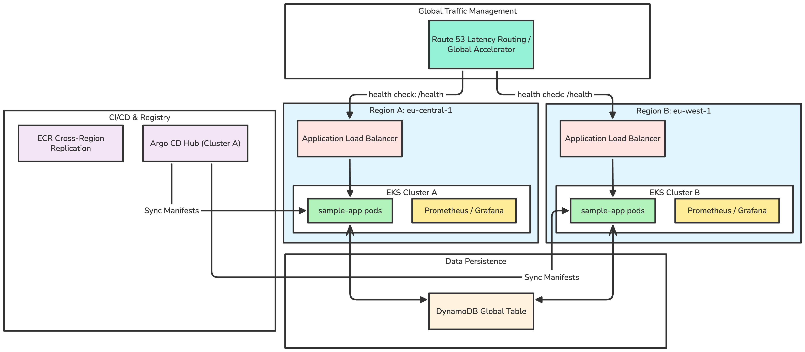

# Kubernetes Multi-Site DR

This document designs a portfolio project that runs a Kubernetes workload across two AWS Regions in an active-active pattern. It uses two independent EKS clusters, one per Region, deployed and kept in sync with Argo CD. A small sample application runs in both Regions at the same time, writes to a multi-Region data store, and is reachable through a single global entry point.

The design is deliberately small enough to build and reason about, but close enough to a real multi-Region setup to discuss in a design review. It is a learning setup, not a production reference architecture.

Important scope note: this is a **multi-Region, single AWS account** design. It does not use multiple AWS accounts. A production setup would normally separate Regions and environments across accounts, but that adds account boundaries, cross-account IAM, and organization management that are out of scope here.

## Table of Contents

- [1. Overview](#1-overview)
- [2. Target Audience](#2-target-audience)
- [3. What Problem This Project Solves](#3-what-problem-this-project-solves)
- [4. Architecture Summary](#4-architecture-summary)
- [5. AWS Components](#5-aws-components)
- [6. Kubernetes Components](#6-kubernetes-components)
- [7. GitOps / Argo CD Model](#7-gitops--argo-cd-model)
- [8. Database Design Options](#8-database-design-options)
- [9. Sample Application Design](#9-sample-application-design)
- [10. Traffic Routing](#10-traffic-routing)
- [11. Failure Scenarios](#11-failure-scenarios)
- [12. Regional Failure Flow](#12-regional-failure-flow)
- [13. Observability](#13-observability)
- [14. Security Considerations](#14-security-considerations)
- [15. Local vs Real AWS Limitations](#15-local-vs-real-aws-limitations)
- [16. Step-by-Step Implementation Plan](#16-step-by-step-implementation-plan)
- [17. Repository Structure](#17-repository-structure)
- [18. Architecture Diagram](#18-architecture-diagram)
- [19. What This Project Demonstrates](#19-what-this-project-demonstrates)
- [20. Disclaimer](#20-disclaimer)

## 1. Overview

The project runs one workload in two AWS Regions:

- Region A: `eu-central-1`
- Region B: `eu-west-1`

Each Region has its own EKS cluster. The two clusters are independent: they do not share a control plane, they do not federate, and neither depends on the other to stay up. Argo CD deploys the same application definition to both clusters from a single Git repository, so the two Regions run the same version of the application.

A sample FastAPI application runs in both clusters at the same time. It reads and writes to a DynamoDB Global Table, which replicates data between the two Regions. A global routing layer (Route 53 latency-based routing or AWS Global Accelerator) sends each user to a healthy Region and moves traffic away from a Region that fails its health check.

The result is an active-active setup where both Regions serve live traffic. If one Region is lost, the other continues to serve requests with the replicated data it already has.

## 2. Target Audience

This project is written for:

- DevOps, Platform, and SRE engineers who want a concrete multi-Region Kubernetes example.
- Cloud engineers preparing for design reviews or interviews on DR and multi-Region topics.
- Engineers who understand single-cluster Kubernetes and want to see what changes when a second Region is added.

It assumes working knowledge of Kubernetes objects (Deployment, Service, Ingress), basic AWS (VPC, IAM, EKS), and GitOps concepts. It does not assume prior multi-Region experience.

## 3. What Problem This Project Solves

A single-Region Kubernetes deployment has a Region as a single point of failure. Multi-AZ deployments survive the loss of an Availability Zone, but not the loss of a whole Region, and not a control plane or Regional service disruption.

This project demonstrates how to answer these questions in a hands-on way:

- How do you run the same application in two Regions at once?
- How do you keep both Regions on the same version without manual `kubectl` in each cluster?
- How do you route users to a healthy Region and fail away from a broken one?
- What does the data layer have to look like for both Regions to accept writes?
- What breaks, and what stays up, when a Region is lost?

It also makes the trade-offs explicit. Active-active is not free: it forces decisions about data consistency, conflict handling, and cost. This project shows where those decisions live.

## 4. Architecture Summary

- Two AWS Regions in one account: `eu-central-1` (A) and `eu-west-1` (B).
- One EKS cluster per Region, each in its own VPC, each fully independent.
- One Git repository holds application manifests and Argo CD configuration.
- Argo CD deploys the same application to both clusters. It can run in a hub-and-spoke model (one Argo CD manages both clusters) or one Argo CD instance per cluster.
- Container images are stored in ECR and replicated between the two Regions so each cluster pulls from a local registry.
- DynamoDB Global Tables provide multi-Region read and write for application data.
- External Secrets Operator pulls secrets from AWS Secrets Manager into each cluster.
- Route 53 latency-based routing or AWS Global Accelerator provides one global entry point and health-checked failover.
- Prometheus and Grafana run per cluster. Logs go to Loki per cluster or to CloudWatch Logs.

## 5. AWS Components

| Component | Purpose | Scope |
| :--- | :--- | :--- |
| EKS (2 clusters) | Kubernetes control plane and nodes | One per Region |
| VPC (2) | Network isolation per Region | One per Region |
| ECR | Container image registry with cross-Region replication | Replicated A ↔ B |
| DynamoDB Global Tables | Multi-Region application data store | Global table across A and B |
| Route 53 | Latency-based DNS routing and health checks | Global |
| AWS Global Accelerator (alternative) | Anycast global entry point with health-checked endpoints | Global |
| Secrets Manager | Source of application secrets | Per Region, or replicated |
| IAM / IRSA | Pod-level AWS permissions | Per cluster |
| CloudWatch | Metrics, logs, and Route 53 health check alarms | Per Region |
| Application Load Balancer | Regional ingress for each cluster | One per Region |

Notes:

- ECR replication is configured with a replication rule so an image pushed in Region A appears in Region B. Each cluster pulls from its local Region to avoid cross-Region pull latency and data transfer cost.
- DynamoDB Global Tables are a single logical table with replicas in both Regions. There is no separate primary.
- Secrets Manager can either be per-Region (a copy of the secret in each Region) or use multi-Region replication of a secret. This design uses per-Region secrets referenced by External Secrets Operator.

## 6. Kubernetes Components

Each cluster runs the same set of platform components:

| Component | Role |
| :--- | :--- |
| Argo CD | GitOps controller that syncs application state from Git |
| AWS Load Balancer Controller | Provisions ALBs for Ingress objects |
| External Secrets Operator | Syncs secrets from Secrets Manager into Kubernetes Secrets |
| External DNS (optional) | Manages Route 53 records for Ingress hosts |
| Prometheus + Grafana | Metrics collection and dashboards |
| Loki or CloudWatch agent | Log aggregation |
| Metrics Server | Resource metrics for HPA |
| Sample application | The workload under test |

The two clusters are configured identically through Git. Region-specific values (Region name, ECR registry URL, DynamoDB endpoint Region) are supplied per cluster through Argo CD parameters or Kustomize overlays, not by editing the base manifests.

## 7. GitOps / Argo CD Model

One Git repository is the single source of truth. It contains:

- The base application manifests.
- Two overlays, one per Region, that set Region-specific values.
- Argo CD `Application` (or `ApplicationSet`) definitions that map each overlay to a target cluster.

Two workable topologies:

**Hub-and-spoke (recommended here).** One Argo CD instance, running in cluster A, is registered with both clusters as deployment targets. An `ApplicationSet` generates one `Application` per cluster from a single template. This keeps all deployment state in one place and is easy to demonstrate.

**Argo CD per cluster.** Each cluster runs its own Argo CD, and each watches the same repository but only deploys its own overlay. This removes the cross-cluster dependency of the hub model at the cost of running and configuring Argo CD twice.

Trade-off: the hub model is simpler to operate but makes cluster A's Argo CD a dependency for deployments to cluster B. If cluster A is down, cluster B keeps running its last-synced state but cannot receive new deployments until Argo CD is back. For a DR-focused project, this is worth calling out explicitly. The per-cluster model avoids it.

Example `ApplicationSet` using a cluster generator:

```yaml
apiVersion: argoproj.io/v1alpha1
kind: ApplicationSet
metadata:
  name: sample-app
  namespace: argocd
spec:
  generators:
    - clusters: {}
  template:
    metadata:
      name: 'sample-app-{{name}}'
    spec:
      project: default
      source:
        repoURL: https://github.com/example/kubernetes-multi-site-dr.git
        targetRevision: main
        path: 'apps/sample-app/overlays/{{metadata.labels.region}}'
      destination:
        server: '{{server}}'
        namespace: sample-app
      syncPolicy:
        automated:
          prune: true
          selfHeal: true
```

Each registered cluster carries a `region` label (`eu-central-1` or `eu-west-1`) that selects the matching overlay.

## 8. Database Design Options

The data layer decides whether the setup is truly active-active. The application must write in both Regions, so the store must accept writes in both Regions and replicate between them. Three options follow, with the recommendation first.

### Option A: DynamoDB Global Tables (preferred)

DynamoDB Global Tables is a single logical table with replicas in `eu-central-1` and `eu-west-1`.

- Both application instances can write. There is no primary Region; each Region writes to its local replica.
- DynamoDB replicates changes between Regions asynchronously, usually within a second. Cross-Region reads are therefore eventually consistent: an item written in one Region appears in the other after a short delay.
- Conflict resolution is last-writer-wins. If the same item is written in both Regions at nearly the same time, the write with the latest timestamp wins and the other is discarded.
- This is a good fit for demonstrating active-active behavior: the `/write` endpoint works in either Region, and a `/read` in the other Region returns the replicated item shortly after.

Trade-off: last-writer-wins can silently drop a concurrent write. That is acceptable for this project, where the goal is to show multi-Region writes rather than guarantee every write survives, but not for data where every write must be preserved.

### Option B: Aurora Global Database

Aurora Global Database is a relational option with a primary Region and one or more secondary Regions.

- Normally there is one writer Region. The secondary Region holds a read replica.
- The secondary Region serves reads with low replication lag but does not accept normal relational writes.
- This suits active-passive or active-read / passive-write DR: both Regions can read, only one can write.
- On failure of the primary Region, a secondary can be promoted to writer, but that is a failover event, not simultaneous multi-Region writes.

Trade-off: this is not true active-active for standard relational writes. It is a strong option when the application needs relational integrity and can accept a single writer.

### Option C: PostgreSQL with logical replication

Self-managed PostgreSQL with logical replication between Regions can be configured for bidirectional replication, but it is the hardest option.

- Bidirectional (multi-master) logical replication is complex to set up and operate.
- Conflict handling is hard: primary key collisions, update conflicts, and delete/update races need explicit rules or extensions.
- It is not a good fit for a simple demo because most of the effort goes into replication and conflict plumbing rather than the DR behavior this project is meant to show.

### Recommendation

Use **DynamoDB Global Tables** for the sample application. It gives multi-Region writes with minimal setup, replicates automatically between both Regions, and lets the project demonstrate active-active behavior directly. Its last-writer-wins model is a limitation to state clearly, not a reason to avoid it here.

## 9. Sample Application Design

The sample application is a small Python FastAPI service. It is intentionally simple so the DR behavior, not the application logic, is the focus.

Behavior:

- On startup it reads its Region from an environment variable (`AWS_REGION` / `APP_REGION`).
- It uses a DynamoDB Global Table for storage, talking to its local Region replica.
- It exposes endpoints for health, region identification, writes, reads, listing, and metrics.

Endpoints:

```text
GET  /health        Liveness/readiness check, returns 200 when the app is up
GET  /region        Returns the Region this instance runs in
POST /write         Writes an item to DynamoDB, returns the generated id
GET  /read/{id}     Reads a single item by id
GET  /items         Lists items (bounded scan or query)
GET  /metrics       Prometheus metrics endpoint
```

Endpoint notes:

- `/health` backs the ALB target group and Route 53 / Global Accelerator health checks. It should not depend on DynamoDB, so a data-layer issue does not pull a whole Region out of rotation unless intended.
- `/region` returns the responding instance's Region, which makes it easy to see which Region served a request during a failover test.
- `/write` and `/read/{id}` prove active-active: a write served in Region A can be read from Region B once replication catches up.

Minimal endpoint sketch:

```python
from fastapi import FastAPI, HTTPException
from prometheus_fastapi_instrumentator import Instrumentator
import os, uuid, time, boto3

app = FastAPI()
REGION = os.environ.get("APP_REGION", os.environ.get("AWS_REGION", "unknown"))
TABLE = os.environ.get("TABLE_NAME", "dr-items")
ddb = boto3.resource("dynamodb", region_name=REGION).Table(TABLE)

@app.get("/health")
def health():
    return {"status": "ok"}

@app.get("/region")
def region():
    return {"region": REGION}

@app.post("/write")
def write(payload: dict):
    item_id = str(uuid.uuid4())
    ddb.put_item(Item={
        "id": item_id,
        "region": REGION,
        "payload": payload,
        "created_at": int(time.time()),
    })
    return {"id": item_id, "region": REGION}

@app.get("/read/{item_id}")
def read(item_id: str):
    result = ddb.get_item(Key={"id": item_id})
    if "Item" not in result:
        raise HTTPException(status_code=404, detail="not found")
    return result["Item"]

@app.get("/items")
def items():
    return {"items": ddb.scan(Limit=50).get("Items", [])}

Instrumentator().instrument(app).expose(app)  # serves /metrics
```

The application runs as a Deployment with a Service and an Ingress (ALB) per cluster. It is stateless; all state lives in DynamoDB.

## 10. Traffic Routing

A single global entry point sits in front of both Regions. Two options:

**Route 53 latency-based routing.** Create two records for the application hostname, one pointing at the ALB in each Region, each with a Route 53 health check against `/health`. Route 53 sends each user to the Region with the lowest latency and removes a Region from DNS answers when its health check fails.

- Simple and cheap.
- Failover speed depends on DNS TTL and client caching. Set a low TTL (for example 30–60 seconds) to speed failover, accepting more DNS queries.

**AWS Global Accelerator.** Provide two static anycast IPs. Register the two Regional ALBs as endpoints. Global Accelerator health-checks each endpoint and shifts traffic at the network layer, without depending on DNS caching.

- Faster and more predictable failover than DNS.
- Higher cost and one more component to manage.

Recommendation: use Route 53 latency-based routing here because it is cheaper and easier to reason about, and note Global Accelerator as the option to use when DNS-caching failover delay is unacceptable.

In both cases, each Region's ALB target group health-checks `/health` on the pods, so an unhealthy pod is removed locally before the whole Region is affected.

## 11. Failure Scenarios

This project should demonstrate these failures and the observed behavior.

| Scenario | How to simulate | Expected behavior |
| :--- | :--- | :--- |
| Single pod failure | Delete a pod in Region A | Deployment reschedules it; ALB routes to healthy pods; no user impact |
| Application unhealthy in one Region | Make `/health` return 500 in Region A | ALB and global router remove Region A; traffic shifts to Region B |
| Full Region A outage | Scale Region A app to zero, or block its ALB | Global router fails over to Region B; DynamoDB in B still serves replicated data |
| DynamoDB replication lag | Write in A, immediately read in B | Item may 404 briefly, then appears after replication; demonstrates eventual consistency |
| Argo CD (hub) down | Stop Argo CD in cluster A | Both clusters keep running last-synced state; new deploys blocked until Argo CD returns |
| Concurrent write conflict | Write same logical item in both Regions at once | Last-writer-wins; one write is kept, illustrating the DynamoDB trade-off |

For each scenario, capture: which Region served requests (via `/region`), error rate and latency during the transition, and time to recover.

## 12. Regional Failure Flow

What happens when Region A becomes unavailable:

- The Route 53 (or Global Accelerator) health check against `/health` in Region A starts failing.
- After the failure threshold is reached, Route 53 stops returning the Region A endpoint; new lookups resolve to Region B only.
- In-flight connections to Region A break; clients reconnect and, with a low DNS TTL, land on Region B.
- Region B keeps serving traffic using the data already replicated to it through DynamoDB Global Tables.
- No manual data failover is needed, because DynamoDB has no single primary Region.
- The Argo CD hub and the monitoring stack in Region A are gone; Region B runs its last-synced state but cannot receive new deployments until the hub returns.
- When Region A comes back, DynamoDB resumes replication and reconciles the two replicas, applying last-writer-wins to any conflicts.
- Argo CD re-syncs Region A to the current Git state, and the global router adds it back once `/health` passes again.

## 13. Observability

Each cluster runs its own observability stack; there is no shared monitoring plane by default.

- **Metrics.** Prometheus scrapes the application `/metrics` endpoint and cluster components. Grafana dashboards show request rate, error rate, and latency per Region. A Region label on metrics makes it possible to compare A and B side by side.
- **Logs.** Loki per cluster, or ship logs to CloudWatch Logs per Region. Application logs include the Region so a request can be traced to the Region that served it.
- **Health and failover signals.** Route 53 health check status and CloudWatch alarms show when a Region is marked unhealthy. This is the signal that a failover occurred.
- **Key indicators to watch during a test.** Per-Region request share, per-Region error rate, DynamoDB replication latency (from CloudWatch `ReplicationLatency`), and failover time.

Because monitoring is per cluster, a full Region A outage also removes Region A's Grafana and Prometheus. Here this is acceptable; a production setup would send metrics to a location that survives a Regional loss (for example a managed monitoring service or a third observability Region).

## 14. Security Considerations

- **IAM / IRSA.** The application uses IAM Roles for Service Accounts so pods get only DynamoDB permissions scoped to the project table, not node-wide credentials. Keep the policy limited to the specific table and actions used.
- **Secrets.** External Secrets Operator pulls secrets from Secrets Manager into Kubernetes Secrets. Secrets are not committed to Git. Only references to secret names live in the repository.
- **Least privilege.** Argo CD, the Load Balancer Controller, and External Secrets each get their own scoped IAM role. Avoid cluster-admin where a narrower role works.
- **Network.** Each cluster is in its own VPC. Application ALBs are the only public entry points. Node and pod traffic stays within the Region's VPC.
- **RBAC.** Keep Kubernetes RBAC minimal. The sample application service account needs no Kubernetes API access beyond defaults.
- **Registry.** ECR repositories are private; image pulls use the cluster's node or pod IAM role. Enable scan-on-push if demonstrating image scanning.
- **Single account caveat.** Because this is one AWS account, there is no account boundary between Regions. A production design would usually isolate Regions and environments across accounts to limit blast radius. State this limitation clearly.

## 15. Local vs Real AWS Limitations

The design targets real AWS. Parts of it can be approximated locally, but several pieces cannot be reproduced faithfully.

| Aspect | Real AWS | Local approximation |
| :--- | :--- | :--- |
| EKS clusters | Two managed clusters in two Regions | Two `kind` or `k3d` clusters on one machine |
| Regions | Genuine Regional isolation and latency | Simulated only; no real Regional boundary |
| DynamoDB Global Tables | Real cross-Region replication | DynamoDB Local has no Global Tables; replication must be faked |
| Route 53 / Global Accelerator | Real health-checked global routing | Local load balancer or `/etc/hosts`; no real latency routing |
| ECR replication | Real cross-Region image replication | Single local registry shared by both clusters |
| IRSA | Real IAM-scoped pod identity | Static credentials or mocked IAM |

What this means: a local build is useful for validating the GitOps flow, the application, and the failover logic at the Kubernetes level. It cannot validate real Regional failover, real replication latency, or real global routing. Those require deploying to AWS. Be explicit about which claims are validated locally and which need real AWS.

## 16. Step-by-Step Implementation Plan

1. **Repository and application.** Create the Git repository. Build the FastAPI application, containerize it, and write the base Kubernetes manifests (Deployment, Service, Ingress, ServiceAccount).
2. **ECR.** Create an ECR repository in Region A, enable cross-Region replication to Region B, and push the image. Confirm the image appears in both Regions.
3. **Networking.** Create a VPC in each Region (or use Terraform/eksctl to do this with the cluster).
4. **EKS clusters.** Create the EKS cluster in `eu-central-1` and the EKS cluster in `eu-west-1`. Confirm `kubectl` access to both.
5. **Platform add-ons.** Install the AWS Load Balancer Controller, External Secrets Operator, and Metrics Server on each cluster.
6. **DynamoDB.** Create the table in Region A and add a Region B replica to make it a Global Table. Confirm writes in one Region appear in the other.
7. **IRSA.** Create the IAM role and policy for the application scoped to the DynamoDB table, and bind it to the application service account in both clusters.
8. **Argo CD.** Install Argo CD (hub in cluster A, or one per cluster). Register both clusters. Create the `ApplicationSet` and the two Region overlays.
9. **Deploy.** Let Argo CD sync the application to both clusters. Verify `/region` returns the correct Region in each.
10. **Global routing.** Configure Route 53 latency-based records with health checks against each ALB `/health` (or set up Global Accelerator). Verify the global hostname reaches both Regions.
11. **Observability.** Install Prometheus and Grafana per cluster, wire up the `/metrics` scrape, and add dashboards. Configure logs to Loki or CloudWatch.
12. **Failure testing.** Run the scenarios in section 11. Record behavior, failover time, and replication lag.
13. **Document results.** Capture screenshots, dashboards, and observed timings in the repository.

## 17. Repository Structure

This is the layout the project would use if built out; the files themselves are not part of this document.

```text
kubernetes-multi-site-dr/
├── README.md
├── app/
│   ├── main.py                 # FastAPI application
│   ├── requirements.txt
│   └── Dockerfile
├── infra/
│   └── terraform/
│       ├── region-a/           # VPC, EKS, IAM, DynamoDB (eu-central-1)
│       ├── region-b/           # VPC, EKS, IAM (eu-west-1)
│       ├── ecr/                # ECR repo + replication rule
│       └── dns/                # Route 53 records + health checks
├── platform/
│   ├── argocd/                 # Argo CD install + ApplicationSet
│   ├── external-secrets/
│   ├── load-balancer-controller/
│   └── monitoring/             # Prometheus, Grafana, Loki
├── apps/
│   └── sample-app/
│       ├── base/               # base Kubernetes manifests
│       └── overlays/
│           ├── eu-central-1/   # Region A values
│           └── eu-west-1/      # Region B values
├── tests/
│   └── failure-scenarios/      # scripts for section 11
└── docs/
    └── results/                # screenshots, dashboards, timings
```

## 18. Architecture Diagram



## 19. What This Project Demonstrates

- Running one Kubernetes workload active-active across two AWS Regions.
- GitOps with Argo CD deploying identical state to multiple clusters from one repository.
- Multi-Region data with DynamoDB Global Tables, and a clear understanding of its last-writer-wins model.
- Global traffic routing and health-checked failover with Route 53 or Global Accelerator.
- Cross-Region image distribution with ECR replication.
- Secret handling with External Secrets Operator and scoped IAM via IRSA.
- Per-cluster observability and how to reason about it during a Regional loss.
- The ability to state trade-offs and limitations honestly: data conflict handling, single-account blast radius, hub dependency, and DNS failover timing.

## 20. Disclaimer

This is a learning project, not a production reference architecture. It runs in a single AWS account, which removes the account-level isolation a real multi-Region design would normally have. The data model uses last-writer-wins, which can drop concurrent writes and is not suitable for workloads that require every write to be preserved. Observability is per cluster and does not survive a full Regional loss.

Recovery targets, data consistency requirements, cost limits, and operational procedures must be driven by real business requirements and validated through testing before any of this is applied to a production system. Costs are incurred when running this on real AWS (EKS control planes, load balancers, DynamoDB, Global Accelerator, cross-Region data transfer); tear down resources when it is not in use.
