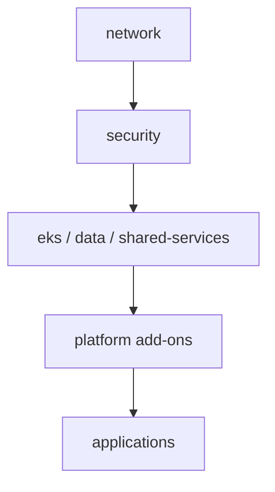

# Breaking a Terraform Monolith into Independent State Components

## Who This Document Is For

This document is for senior DevOps engineers, platform engineers, SREs, teams maintaining existing Terraform infrastructure, and engineers preparing for architecture interviews.

It focuses on production migration from an existing Terraform monolith, not a greenfield layout.

## Disclaimer

Terraform state operations can cause production outages when they are rushed or applied to the wrong state. Test every migration workflow first on non-production infrastructure with realistic backends, locking, provider versions, and CI/CD behavior.

This document shows safe operating patterns, but state migration is not risk-free.

## Starting Point

Many teams begin with one root module and one backend:

```text
terraform/
├── main.tf
├── networking.tf
├── iam.tf
├── eks.tf
├── databases.tf
├── applications.tf
└── one shared terraform state
```

The target is multiple deployable root modules, each with its own backend key and state file:

```text
live/
├── dev/
│   ├── network/
│   ├── security/
│   ├── eks/
│   ├── data/
│   ├── shared-services/
│   └── applications/
├── staging/
└── production/

modules/
├── network/
├── eks/
├── database/
├── security/
└── application/
```

Example production state keys:

```text
production/network.tfstate
production/security.tfstate
production/eks.tfstate
production/data.tfstate
production/shared-services.tfstate
production/applications/service-a.tfstate
```

These state key names are simplified migration examples. In a real repository, choose one naming convention and use it consistently across Terraform, Terragrunt, CI/CD, IAM policies, and documentation. Other documents in this repository may show different valid examples, such as `<domain>/<environment>/<team-or-service>/terraform.tfstate` or Terragrunt's `${path_relative_to_include()}/terraform.tfstate`; do not mix multiple conventions in the same platform without a deliberate reason.

## 1. The Terraform Monolith Problem

A large Terraform root module becomes difficult to operate because every plan and apply evaluates one broad deployment unit. When networking, IAM, EKS, databases, and applications share one state, an application change can appear in the same plan as unrelated platform changes.

Common problems:

- Large blast radius.
- Slow `terraform plan` and refresh.
- Long state locks.
- Unrelated teams blocking each other.
- Excessive permissions for anyone allowed to apply.
- Tightly coupled deployments.
- Accidental changes to unrelated infrastructure.
- Difficulty assigning ownership.
- Difficult rollback and incident recovery.

Splitting Terraform files does not split Terraform state. These files:

```text
network.tf
database.tf
eks.tf
```

are still one deployment unit when they are in the same root module and use the same backend. Terraform loads all `.tf` files in a root module together. The backend and root module boundary decide the state boundary, not the filename.

## 2. How To Choose State Boundaries

State boundaries should follow operational boundaries:

- Ownership.
- Lifecycle.
- Change frequency.
- Blast radius.
- Security boundary.
- Deployment frequency.
- Failure domain.
- Dependency direction.

| Component | Owner | Change Frequency | Blast Radius | Suggested State |
| --- | --- | ---: | ---: | --- |
| VPC and routing | Platform | Low | High | network |
| Shared IAM and KMS | Security/Platform | Low | High | security |
| EKS cluster | Platform | Medium | High | eks |
| RDS and caches | Platform/Data | Low | High | data |
| Application resources | Application team | High | Low/Medium | per application |

The goal is not to create a state file for every resource. Too many tiny states create their own failure mode: excessive remote-state wiring, harder dependency tracking, more pipelines, more backend configuration, and more chances to apply components in the wrong order.

A useful state should represent a component that has a clear owner, a coherent lifecycle, and a practical approval boundary.

## 3. Target Architecture

A production decomposition should keep dependencies mostly one-way:

```text
network
   ↓
security
   ↓
eks / data / shared-services
   ↓
platform add-ons
   ↓
applications
```



Do not build a fully connected dependency graph. If every state reads every other state, the system is still coupled; it only has more files. Prefer dependencies that flow from foundational infrastructure toward runtime services and then applications.

## 4. Modules Versus Root Modules

Terraform modules, deployable root modules, and state boundaries are different concepts.

Reusable Terraform modules answer:

```text
How do we create this kind of infrastructure consistently?
```

Examples:

```text
modules/network
modules/eks
modules/database
modules/application
```

Deployable root modules answer:

```text
What infrastructure do we deploy for this component in this environment?
```

Examples:

```text
live/production/network
live/production/eks
live/production/applications/service-a
```

A reusable module does not automatically get its own state. State belongs to the root module that calls it.

Each independently deployed component must have:

- Its own root module.
- Its own backend configuration.
- Its own variables.
- Its own pipeline.
- Its own state lock.

## 5. Sharing Information Between States

States need small, stable interfaces. Treat outputs like an API contract. Expose IDs and names that consumers need; do not expose complete Terraform resource objects.

### `terraform_remote_state`

Use `terraform_remote_state` when one Terraform root module needs stable outputs from another state:

```hcl
data "terraform_remote_state" "network" {
  backend = "s3"

  config = {
    bucket = "company-terraform-state"
    key    = "production/network.tfstate"
    region = "eu-central-1"
  }
}
```

Network state outputs:

```hcl
output "vpc_id" {
  value = aws_vpc.main.id
}

output "private_subnet_ids" {
  value = aws_subnet.private[*].id
}
```

Consumer usage:

```hcl
module "service_a" {
  source = "../../../../modules/application"

  vpc_id             = data.terraform_remote_state.network.outputs.vpc_id
  private_subnet_ids = data.terraform_remote_state.network.outputs.private_subnet_ids
}
```

Do not expose entire resources:

```hcl
# Avoid this pattern.
output "vpc" {
  value = aws_vpc.main
}
```

### AWS Data Sources

Use AWS data sources when consumers can safely discover resources by stable names or tags:

```hcl
data "aws_vpc" "shared" {
  tags = {
    Environment = "production"
    Component   = "network"
  }
}
```

This reduces direct state coupling, but it depends on reliable naming and tagging. It can also hide dependency ordering because Terraform no longer knows that one state must be applied before another.

### SSM Parameter Store

Use SSM Parameter Store when platform outputs should be published as stable platform configuration:

```text
/production/network/vpc_id
/production/network/private_subnet_ids
/production/eks/cluster_name
```

This is useful when consumers include Terraform, deployment scripts, services, or operational tools. It creates a narrower contract than remote state, but the publishing state must keep parameters current.

### Secrets Manager

Use Secrets Manager for sensitive data that should not pass through ordinary Terraform outputs. Terraform outputs can be marked `sensitive`, but the values may still exist in state. For database passwords, API credentials, and other secrets, prefer a secret manager and grant consumers read access only where needed.

| Approach | Advantages | Disadvantages |
| --- | --- | --- |
| `terraform_remote_state` | Simple, explicit Terraform-to-Terraform contract | Couples consumers to backend access and exposes all root outputs |
| AWS data sources | Avoids direct state access, works with existing resources | Depends on tags/names and can hide ordering |
| SSM Parameter Store | Stable platform configuration, usable outside Terraform | Requires publishing and versioning discipline |
| Secrets Manager | Better access control and rotation support for secrets | More operational setup and permissions management |

## 6. Migration Strategy

Migrate incrementally. The safe production approach is to move one component, validate, restore normal operations, and repeat.

Recommended phases:

1. Inventory all resources in the monolith with `terraform state list`.
2. Map dependencies between resources and modules.
3. Identify ownership and lifecycle boundaries.
4. Freeze unrelated Terraform changes.
5. Back up and version the current state.
6. Create the new root module.
7. Create the new backend key.
8. Move a small component first.
9. Validate both source and destination states.
10. Re-enable CI/CD.
11. Repeat component by component.

Start with a relatively isolated component, such as an application-owned S3 bucket, queue, or service-specific IAM role. Do not start with the VPC, IAM foundation, EKS control plane, or a production database unless there is a strong operational reason.

Avoid changing Terraform code behavior and state ownership at the same time. First make the new root module describe the same existing infrastructure. Then move state. Then run zero-change validation.

## 7. Moving Resources Between States

The traditional workflow is:

1. Pull the current source state.
2. Create a destination state for the new root module.
3. Move resource bindings from source state to destination state.
4. Push state only after strict validation and only when using this manual workflow.
5. Run plans against both root modules.

Example using generic local state copies:

```bash
terraform state pull > monolith-backup.tfstate

cp monolith-backup.tfstate source.tfstate
cp empty-destination.tfstate destination.tfstate
```

Move one resource binding:

```bash
terraform state mv \
  -state=source.tfstate \
  -state-out=destination.tfstate \
  'module.monolith.aws_subnet.private["eu-central-1a"]' \
  'aws_subnet.private["eu-central-1a"]'
```

The destination address must match the resource address in the new root module. If the new root module declares:

```hcl
resource "aws_subnet" "private" {
  for_each = var.private_subnets
}
```

then the destination address can be:

```text
aws_subnet.private["eu-central-1a"]
```

Useful mechanisms and limitations:

| Mechanism | Use | Limitation |
| --- | --- | --- |
| `terraform state mv` | Move state bindings between addresses or state files | Does not change remote infrastructure; wrong addresses create bad ownership |
| `terraform state pull` | Create a local copy for inspection or migration | Local files can become stale quickly |
| `terraform state push` | Replace remote state with a validated local state | High risk; use only with strict validation, backups, locking, and change freeze |
| `moved` blocks | Declare address changes inside compatible configurations | Best for refactors inside one state; not a full architecture migration tool |
| `removed` blocks | Stop Terraform managing an object without destroying it | Does not transfer ownership to another state |
| Terraform import blocks | Adopt existing infrastructure declaratively | Requires matching configuration; does not generate full production-ready configuration |
| `tfmigrate` | Store state migrations as code | Still requires correct boundaries, addresses, review, and rollback planning |

Do not treat `terraform state push` as a normal first choice. Prefer backend-native versioning, local validation, peer review, locked pipelines, and tested migration tooling. A bad pushed state can make Terraform forget production resources or think it owns resources it should not.

## 8. Practical Migration Example

Original monolith contains:

- VPC.
- Subnets.
- EKS cluster.
- RDS database.
- Application S3 bucket.

The first migration moves only the application S3 bucket into:

```text
live/production/applications/service-a
```

Backend key:

```text
production/applications/service-a.tfstate
```

Original resource address:

```text
module.monolith.aws_s3_bucket.service_a
```

New resource address:

```text
aws_s3_bucket.service_a
```

Destination root module:

```text
live/production/applications/service-a
```

Destination configuration must describe the existing bucket without changing it:

```hcl
terraform {
  backend "s3" {
    bucket         = "company-terraform-state"
    key            = "production/applications/service-a.tfstate"
    region         = "eu-central-1"
    dynamodb_table = "company-terraform-locks"
    encrypt        = true
  }
}

resource "aws_s3_bucket" "service_a" {
  bucket = "service-a-production-assets"

  tags = {
    Environment = "production"
    Service     = "service-a"
  }
}
```

Example local migration:

```bash
terraform state pull > monolith-backup.tfstate

cp monolith-backup.tfstate source.tfstate
cp empty-destination.tfstate destination.tfstate

terraform state mv \
  -state=source.tfstate \
  -state-out=destination.tfstate \
  'module.monolith.aws_s3_bucket.service_a' \
  'aws_s3_bucket.service_a'
```

Validate the state files before touching remote state:

```bash
terraform state list -state=source.tfstate
terraform state list -state=destination.tfstate
terraform state show -state=destination.tfstate 'aws_s3_bucket.service_a'
```

Expected ownership after the move:

```text
source.tfstate no longer contains module.monolith.aws_s3_bucket.service_a
destination.tfstate contains aws_s3_bucket.service_a
```

When validating against real backends, the expected result is:

```text
Source plan: no destroy of the moved resource
Destination plan: no create of the existing resource
```

The goal is:

```text
0 create
0 change
0 destroy
```

where possible. Some resources may show provider-computed metadata changes after a move; review those carefully and do not accept replacement of production infrastructure.

## 9. Validation Checklist

Before migration:

- State backup exists.
- S3 state versioning is enabled.
- State locking is enabled.
- No concurrent pipeline execution is possible.
- Source and destination provider versions match.
- Source and destination Terraform versions are compatible.
- Resource addresses are verified.
- Destination configuration matches the existing resource.
- Dependency outputs are defined.
- Rollback procedure is documented.

After local state move:

- Source state no longer contains the moved resource address.
- Destination state contains the new resource address.
- AWS resource IDs match the real resource.
- Source plan is reviewed.
- Destination plan is reviewed.
- No replacement actions are present.
- No destroy action appears for the moved resource in the source plan.
- No create action appears for the moved resource in the destination plan.
- CI/CD is re-enabled only after validation.

## 10. CI/CD Architecture

Every component should have its own pipeline:

```text
network pipeline
security pipeline
eks pipeline
data pipeline
application pipeline
```

Each pipeline should run:

```text
fmt
validate
lint
security scan
plan
approval
apply
```

Production platform components should require manual approval. Application components can use faster flows when their permissions are narrow and their blast radius is limited.

One pipeline should not automatically apply the entire infrastructure graph after every small change. A service bucket change should not apply the VPC, shared IAM, EKS control plane, RDS, and other applications. Separate pipelines make ownership, approval, logs, permissions, and rollback easier to reason about.

## 11. Permissions And Ownership

Example ownership model:

```text
Platform team:
- network
- shared IAM
- EKS
- shared observability
- shared DNS

Data or platform team:
- databases
- caches
- backup policies

Application teams:
- application-specific queues
- buckets
- service roles
- application deployment resources
```

Use least privilege per pipeline. The role that applies `live/production/applications/service-a` should manage only Service A resources.

An application pipeline must not have permissions to modify:

- VPC routing.
- Production databases.
- Shared IAM.
- EKS control plane.

This is one of the main reasons to split state. If one state requires broad permissions, every apply path into that state tends to inherit broad risk.

## 12. Common Mistakes

- Splitting Terraform files but keeping one state.
- Creating too many tiny states.
- Creating cyclic remote-state dependencies.
- Exposing too many outputs.
- Moving resources without a state backup.
- Allowing normal pipelines to run during migration.
- Changing Terraform code behavior and state structure simultaneously.
- Renaming resources without accounting for addresses.
- Moving resources with different provider configurations.
- Assuming `terraform import` will generate full configuration.
- Accepting a plan that recreates production infrastructure.

The most dangerous mistake is treating a migration plan as acceptable because it is small. A single replacement of a VPC, database, cluster, or shared IAM role can be a production incident.

## 13. Rollback Strategy

Rollback usually means restoring state ownership, not recreating infrastructure.

Safe rollback principles:

- Preserve the original state backup.
- Disable both source and destination pipelines.
- Verify the actual cloud resource still exists and has not changed unexpectedly.
- Move resource bindings back from destination state to source state when possible.
- Restore a previous S3 state version only as a controlled last-resort action.
- Re-run source and destination plans before re-enabling pipelines.

Do not blindly restore an old state version after infrastructure has changed. If a resource was modified, imported, replaced, or deleted after the backup, restoring old state can make Terraform's view of production wrong. Always compare state, configuration, and the actual cloud resource before restoration.

## 14. Tooling

| Tool | Purpose |
| --- | --- |
| Terraform CLI | Manual state inspection and migration |
| `moved` blocks | Declarative address changes inside compatible configurations |
| Import blocks | Declarative resource adoption |
| `tfmigrate` | Migration definitions stored as code |
| Terragrunt | Organizing multiple root modules and dependencies |
| Atlantis / Terraform Cloud | Controlled plan and apply workflows |

No tool can automatically determine correct architectural state boundaries. Tools can move bindings, organize root modules, and enforce workflow. Engineers still need to decide ownership, lifecycle, blast radius, dependency direction, and rollback strategy.

## 15. How To Explain This In A Senior DevOps Interview

I would not split a Terraform monolith by file. I would split it by lifecycle, ownership, and blast radius. The target is independent root modules with independent backend keys, state locks, variables, and pipelines.

Foundational components such as network, shared security, EKS, and data stores should be owned by platform or security teams and changed through controlled pipelines. Application teams should own narrower application states with limited permissions.

States should share only small stable interfaces, such as VPC IDs, subnet IDs, cluster names, or published SSM parameters. Those outputs are an API contract, not an invitation to expose whole Terraform resources.

For migration, I would inventory the monolith, map dependencies, freeze unrelated changes, back up state, create the destination root module and backend, move one isolated component first, and validate both source and destination plans. The target result is no create, no change, and no destroy where possible.

I would avoid both extremes: one monolithic state that gives every change a large blast radius, and excessive state fragmentation that creates cyclic dependencies and operational noise.
